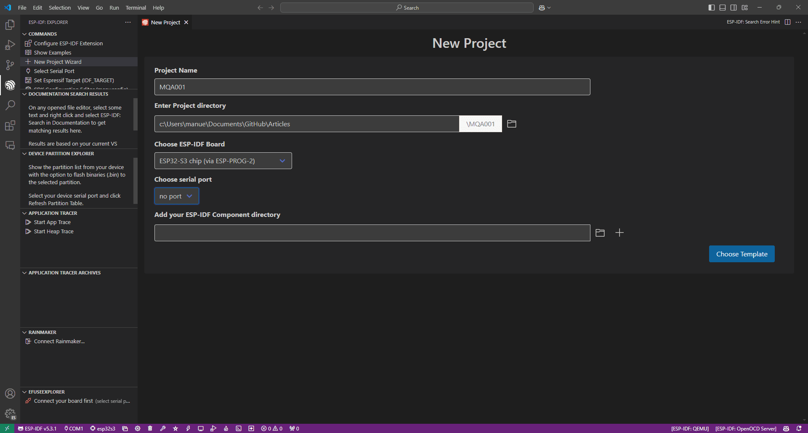
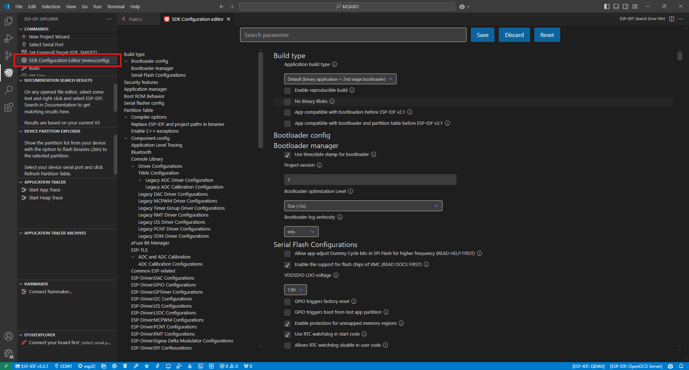
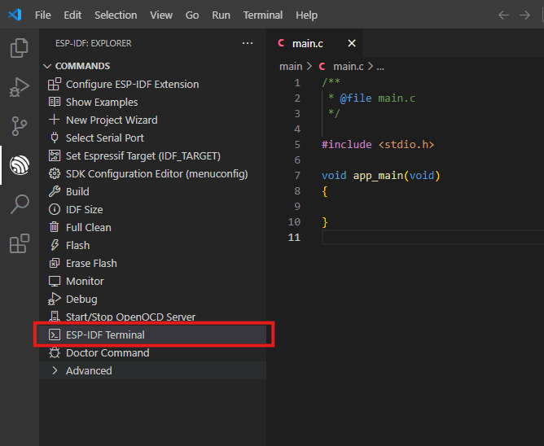
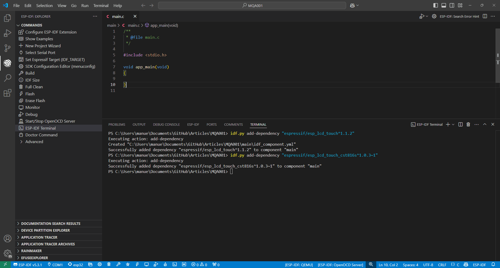
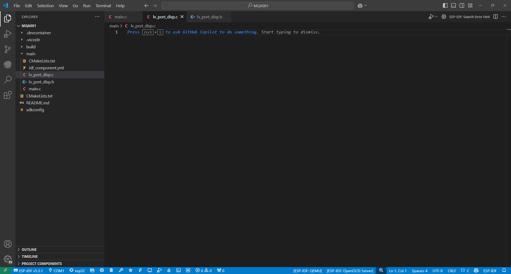

## My Setup

For this **tutorial**, I have used the following **setup of components and versions**. If you are not using these exact components or are working with a different version of ESP-IDF, don't worry, because I’m almost certain it will work just the same.

- Microcontroller: ESP32-S3-WROOM-2

- 2-inch 320x240 Touch Screen
- 

- ESP-IDF 5.3.1

- LVGL 9.2.2

## Create New Project

I have created a **new project** to teach you everything from **scratch**. If you already have a project set up, continue reading in the next section to add the necessary libraries.



After creating the new project, our **main.c** should look like this:

```c

```

Remember to **configure **your microcontroller using the **SDK Configuration Editor:**



## Necessary Libraries

To **control the touchscreen**, we will add the** following two libraries** to the project:

****[esp_lcd_touch](https://components.espressif.com/components/espressif/esp_lcd_touch/versions/1.1.2)****

****[esp_lcd_touch_cst816s](https://components.espressif.com/components/espressif/esp_lcd_touch_cst816s/versions/1.0.3~1)

If you have a** different touchscreen controller**, instead of using the **esp_lcd_touch_cst816s** library, you can** search for a library** for your controller on the **following page:**

[ESP Component Registry](https://components.espressif.com/)

To **add **them, do the following:

1. Open an **ESP-IDF terminal**.



2. In the **terminal, copy the command provided on the library's page.** It should look something like this:



Similarly, you need to add the **LVGL library to the project.** At the following link, you will find the **command **to add it via the terminal:

[lvgl](https://components.espressif.com/components/lvgl/lvgl)

You’re probably wondering, **do I need to add a library to control the display?**

The answer is **YES**, but one advantage of using** ESP-IDF** is that it comes with **many default implementations.** This basically means it **already includes libraries for the main display drivers.**

## Display Configuration

To avoid having a **single file filled with a lot of code that's hard to understand**, we are going to configure the display in a **new file called lv_port_disp**. Create the following files with these names:

- lv_port_disp.h: the header file where we will declare the functions we use.

- lv_port_disp.c: the source file where we will define the functions.

These two files will be set up so that, in the **second part of the article, we can learn how to use LVGL**. They are based on the **templates **from the following link:

****[LVGL Templates](https://github.com/lvgl/lvgl/tree/master/examples/porting)

Create the files so that they are in the same directory as **main.c.**



In the following **GitHub **repository, you can **download and copy the complete code for the article** if you want to have everything readily available. However, we will write the** code step by step and explain it as we go.**

****[GitHub Repository](https://github.com/mquerostudio/blog-articles/tree/master/MQA001)****

## Header File lv_port_disp.h

The **header file will be used to declare the functions and global variables** that we will use in other files. 

Let's start the file by writing the following code:

```c

```

First, we add** information about the file**, such as the file name and a brief description.

The code on lines 8 and 9 is a **programming pattern called an "include guard"**, which is used to **prevent **the **multiple inclusion** of a header file and **avoid compilation errors**. It’s not mandatory to include it, but it’s a **good habit to develop.** If you use it, remember to **add the following line at the end of the file:**

```c

```

In the ***INCLUDES ***section, we will add the header file** esp_lcd_types.h**, which will allow us to declare the variable `panel_handle` of type `esp_lcd_panel_handle_t` in the ***VARIABLES  ***section. We will **define this variable in the source file later** and I will explain **what a handler is**.

The keyword `extern` before the variable declaration **allows it to be accessed from other files** in our project.

Next, we will write the **following code** below:

```c

```

​In this section, we are going to **declare the prototypes of the global functions. **We will only declare` lv_port_disp_init`, which will handle **initializing the driver** to use the display with **LVGL**.

The **lv_port_disp.h **file should look like this:

```c

```

## Source File lv_port_disp.c

In this source file, we will add everything needed to** configure the display driver for LVGL**. We will start by adding the following:

```c

```

First, we add the **basic information** about the file we are writing.

Then, in the ***INCLUDES ***section, we add the libraries that we will use:

- lv_port_disp.h to include the previous header file.

- lvgl.h to use the LVGL library.

- driver/spi_master.h to control the SPI bus of the ESP32, to which the display is connected.

- esp_lcd_panel_io.h to manage the Input/Output (IO) interface of the display.

- esp_lcd_panel_vendor.h to use the display with the ST7789 driver.

- esp_lcd_panel_ops.h to use the functions that control the display.
- esp_heap_caps.h to be able to store the buffers in the SPRAM.

Next, we will write the** following code:**

```c

```

Alright, let's start with the ***DEFINES  ***section:

- CONFIG_LCD_HOST: Here, we define which SPI peripheral we want to use. I recommend using SPI3.

- The next block of defines configures the pins to which the display is connected. Modify it according to your connections.

- With CONFIG_LCD_H_RES and CONFIG_LCD_V_RES, we configure the horizontal and vertical resolution of our display, respectively. If you have a different resolution, adjust it.

- CONFIG_LCD_FREQ sets the operating frequency of the display. Mine works correctly at 80 MHz, but you can lower the frequency to 40 MHz or 20 MHz if you experience any issues.

- CONFIG_LCD_CMD_BITS and CONFIG_LCD_PARAM_BITS configure the number of bits used for commands and parameters sent to the display. Keep it at 8 bits; it's very rare that you’ll need to change this.

- BYTE_PER_PIXEL defines the number of bytes required to represent a pixel in RGB565 format. We will use this later to create the buffers.

Moving on to the ***VARIABLES ***section, we only need to define the **display handler**. It is of type `esp_lcd_panel_handle_t` and we will initialize it with a value of `NULL`.

This **variable **is a **handler that will represent our display in the code**, and we will use it to control the display. Don’t worry if you don’t fully understand this concept yet, as it’s more advanced and will become clearer over time. :)

In the ***STATIC PROTOTYPES*** section, we will **declare the prototypes of the static functions** that we will use in this file. I’ll explain their purpose later on.

Let's get to the **fun part **and write the **only global function we need:**

```c

```

This function is responsible for** setting up and initializing the display using LVGL**. I’ll explain it part by part:

```c

```

Here, the **static function** `**disp_init()**` is called, which we will look at later. It is responsible for **setting up and initializing the display hardware.**

```plaintext

```

- With lv_display_create, we create a new variable that represents the display with the resolution specified by CONFIG_LCD_H_RES and CONFIG_LCD_V_RES. This function initializes a new display in LVGL and returns a pointer to this display, which is stored in the variable disp.

- Using lv_display_set_flush_cb, we link our disp variable to our static function disp_flush. Basically, this makes the disp_flush function a callback responsible for transferring the content of disp 's buffer from LVGL to the physical display. This means that every time LVGL needs to update the display content, it automatically calls disp_flush.

```c

```

In this part of the code, we create two buffers to store the **graphical data **displayed on the screen.

Using `**LV_ATTRIBUTE_MEM_ALIGN**`, we ensure that the buffers `buf1` and `buf2` are **memory-aligned**. By doing this, we guarantee that accessing their data is **efficient and hardware-compatible**. I actually got this explanation from **ChatGPT** because I didn’t know what it was for, haha.

Next, we create the **buffers **of type `uint8_t` with a size sufficient to store a **full frame.** This size is calculated using `**CONFIG_LCD_H_RES * CONFIG_LCD_V_RES * BYTE_PER_PIXEL**`, where, as I explained earlier, `BYTE_PER_PIXEL` defines how many bytes are needed to represent a pixel in RGB565 format.

In addition, using the `heap_caps_malloc` function we select that the buffers are allocated PSRAM memory using `MALLOC_CAP_SPIRAM`.

Finally, with the`** lv_display_set_buffers**` function, we assign the two buffers to the created display and set the rendering mode to `LV_DISPLAY_RENDER_MODE_FULL` taking advantage of the fact that we use PSRAM.

Let's start writing the **static functions**, beginning with `disp_init`, which **initializes the display and the necessary peripherals**. Here is the complete code for the function:

```c

```

At first glance, it might look complicated, so I'll explain it **step by step.**

```c

```

First, **we configure the SPI bus** by defining the variable `bus_cfg` of type `spi_bus_config_t`, which is a structure. This allows us to access the **internal variables** of this structure and **configure** them as needed.

- sclk_io_num and mosi_io_num are the pins used for the clock and the data line.

- We set quadwp_io_num and quadhd_io_num to -1 because I'm using classic SPI.

Then, using the `spi_bus_initialize` function, we initialize the SPI bus by passing **three parameters:**

- The SPI bus we want, specified by CONFIG_LCD_HOST, which we need to cast to spi_host_device_t.

- The bus_cfg variable, prefixed with "&" because it is a structure type variable, and we need to pass its memory address.

- SPI_DMA_CH_AUTO to enable the use of DMA (Direct Memory Access) and choose an automatic channel (don’t ask what it does because it’s complicated to explain; just trust that it makes things faster).

We wrap this function call in `ESP_ERROR_CHECK` to verify if it executes correctly; if there is an **error**, the** program will abort.**

With the next piece of code, we will** configure the necessary input and output** settings for communication with the display.

```c

```

First, we create a variable called `io_handle` of type `esp_lcd_panel_io_handle_t`, which will be responsible for managing the** SPI communication interface with the display.** We initialize it to `NULL` for safety.

Next, we need to create a new variable called `io_cfg` of type `esp_lcd_panel_io_spi_config_t`. Since it is a structure, we will configure its internal variables:

- dc_gpio_num and cs_gpio_num are the Data/Command and Chip Select pins of the display.

- pclk_hz is the SPI clock frequency for the display.

- lcd_cmd_bits and lcd_param_bits have already been explained earlier.

- spi_mode configures the SPI mode. Mode 0 works fine as a default.

- trans_queue_depth is the transaction queue size for SPI. Basically, it determines how many SPI transactions can be queued simultaneously. Ten is a good value.

Finally, using the `esp_lcd_new_panel_io_spi` function, we configure this part. There’s nothing unusual here; it’s almost the same as before, and we also check for errors using `ESP_ERROR_CHECK`.

We’re almost done with this part; now let's configure the display.

```c

```

The procedure is similar. We create the `panel_cfg` variable of type `esp_lcd_panel_dev_config_t`, and since it is a **structure**, we configure its **internal variables** as follows:

- reset_gpio_num is the reset pin of the display.

- rgb_ele_order defines the RGB order. In my case, it isLCD_RGB_ELEMENT_ORDER_RGB, but if your display shows incorrect colors, you can change it to LCD_RGB_ELEMENT_ORDER_BGR.

- bits_per_pixel specifies the number of bits per pixel. It is 16 because, for the RGB565 format, there are 5 bits for red, 6 bits for green, and 5 bits for blue.

- data_endian, the display can use LCD_RGB_DATA_ENDIAN_BIG or LCD_RGB_DATA_ENDIAN_LITTLE. As before, if the colors shown on the display are not as expected, try modifying this variable.

In the same way as before, we complete the configuration using `esp_lcd_new_panel_st7789` and check for errors with `ESP_ERROR_CHECK`.

Now we can **control the display**, so let’s initialize it by following this process.

```c

```

1. Reset.
2. Initialization.
3. Invert colors: in my case, I set it to true so that the colors are displayed correctly.
4. We configure the settings so that X and Y are not swapped.
5. We configure the settings so that the display is not mirrored.
6. Finally, we leave the display turned off to power it on later.

We have now configured and initialized the display! Now let's write the** next static function** (this one will be quick, I promise):

```c

```

This function is used to **update a specific part** of the display with the **content rendered** in one of the buffers we created earlier.

1. We calculate the area offsets: offsetx1, offsetx2, offsety1, and offsety2 are computed based on the area that LVGL needs to update. The values x1, y1, x2, and y2 specify the coordinates of the rectangular area on the display that should be updated.
2. We call esp_lcd_panel_draw_bitmap to draw the image (bitmap) on the display and pass the data to it.
3. We then notify LVGL that the image copying has finished, so it can continue with its tasks.

With all the code, the **lv_port_disp.c** file should look like this:

```c

```

Congratulations! If you've made it this far,** you've survived the tutorial** 🚀

Since this article ended up a **bit long and dense, I’m going to split it.** In the next article, we will **finish configuring the display to use the touchscreen, and I’ll show you how to set up LVGL step by step**, explaining everything along the way. We’ll also** build a real application** with a menu and implement various widgets like text, buttons, and sliders.

Remember you can follow me on** social media** by searching for **@mquerostudio** and on my** YouTube channel @MQuero.**

If you’ve found** any errors** in the article or think there are** ways to improve it,** **feel free to message me** on any of my social platforms, and we’ll discuss it 🙌

:)

