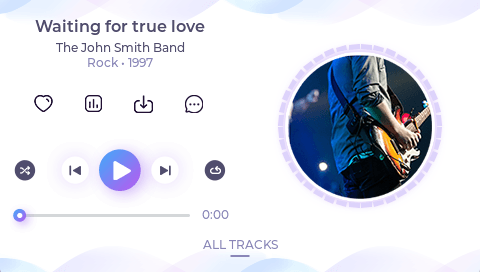
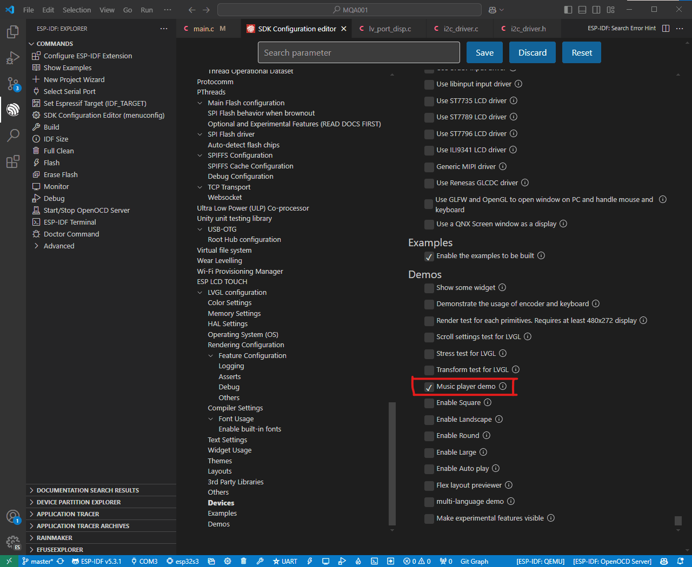

In this **second part of the tutorial **we are going to configure **the i2c driver, the touch screen and we are going to start LVGL.**

When you **finish the article**, you will be able to run one of the default examples that LVGL comes with:



Let's continue where we left off in the first part of the tutorial. **If you have not read the first part of the tutorial I leave it in the following link:**

****[Part 1: How to configure a display to use LVGL with ESP-IDF](https://mquero.com/blog/how-to-configure-a-diplay-for-LVGL)

## My Setup

I am using the following **configuration of components and versions.** Even if you are not using the same components or the same version of ESP-IDF, don't worry because it will probably work for you too.

- Microcontroller: ESP32-S3-WROOM-2
- 2-inch 320x240 Touch Screen
- 
- ESP-IDF 5.3.1
- LVGL 9.2.2

En el siguiente repositorio de **GitHub**, os podeis **descargar y copiar el codigo completo del artículo**, por si lo quereis tener entero ya a mano. 

****[GitHub Repository](https://github.com/mquerostudio/blog-articles/tree/master/MQA001)

We are going to write the code **step by step and explain it.**

## I2C Configuration

First of all, let's** configure the i2c** to **communicate with the touch screen driver **and to be able to use it.

We are going to create** two new files** in the same folder as the main.c folder.

- i2c_driver.h

```c

```

- i2c_driver.c

```c

```

These two files will allow us to initialize the** i2c bus** through the `**i2c_init(void)**` function, and we will be able to control it through its `**i2c_bus_handle**`, which we will have available because in the** header file **we have declared it as `**extern**`.

**It is important that you modify the *****DEFINES *****in the source file to configure the pins to your board or configuration.**

In another tutorial I will tell you about the **i2c driver** and all its **configuration**. For now, with these two files** everything will work.**

To use the** touch screen** **and to make it work with LVGL**, we are going to configure it based on the **templates **that the **LVGL documentation** has.

****[LVGL Templates](https://github.com/lvgl/lvgl/tree/master/examples/porting)****

As we did with the screen in the first part of the tutorial, we are going to create two new files, **lv_port_indev.h** and **lv_port_indev.c**

These two files are going to take care of** initializing the screen touch and configuring LVGL** to use it.

## Header File lv_port_indev.h

Let's write this code:

```c

```

First, we add the **file information** and** include guards** to **avoid multiple inclusion of the header file.**

In the **INCLUDES **section, we add the header file **esp_lcd_touch.h**, which will allow us in the ***VARIABLES ***section to declare the variable `**tp_handle**` of type `**esp_lcd_touch_handle_t**`. 

This variable, is going to be the handler of the touch. If you don't know what is a handler, in the** first part of the tutorial I explain it** (and if not ask ChatGPT that explains better than me🤪).

The word `**extern**` is used to be able to access the handler from other files we have in the project.

In the ***GLOBAL PROTOTYPES*** section we are going to declare the **only global function** that we are going to need `**lv_port_indev_init**`. This function is going to initialize the touch and **register it in LVGL.**

## Source File lv_port_indev.c

As this file is much longer, **let's go in parts.**

```c

```

We are going to start by writing the** basic file information** and then, in the ***INCLUDES ***section, we are going to add the following header files:

- lv_port_indev.h to include the previous header.
- i2c_driver.h  to include the file where we have configured the i2c.
- esp_lcd_touch_cst816s.h to configure our touch.
- lvgl.h to use the LVGL library.

Then in the ***DEFINES ***section, we are going to define the** horizontal and vertical resolution** of the screen and the **interrupt and reset pins.** In my case, my screen is **240x320** and** I have no interrupt or reset pins.**

In the ***VARIABLES ***section, we are going to define the **screen handler** and initialize it with `**NULL**`.

For the **STATIC VARIABLES** section, we are going to create the variable `**indev_touchpad**`, which is a pointer of type `**lv_indev_t**`. This variable is going to be the handler used by LVGL.

We are going to **declare two function prototypes** in the ***STATIC PROTOTYPES*** section:

- touchpad_init(void)

- touchpad_read(lv_indev_t *indev, lv_indev_data_t *data);

These two functions will be used to **start and read the touchpad**. We will define them later.

Let's continue writing the** following code:**

```c

```

Here we declare the **only global function we have.**

1. We initialize the touchpad with touchpad_init();
2. With lv_indev_create() we create a new input device for LVGL.
3. With lv_indev_set_type we tell LVGL that it is of pointer type via LV_INDEV_TYPE_POINTER.
4. We configure with lv_indev_set_read_cb  our callback, which is our function that reads the touchpad.

Let's now define our** two static functions:**

```c

```

First, let's define `**touchpad_init**` to initialize the **touchpad**. Let's go step by step.

We create a variable called `**tp_io_handle**` of type `**esp_lcd_panel_io_handle_t**` and initialize it with `**NULL**`.

We create another one called `**tp_io_config**` of type `**esp_lcd_panel_io_i2c_config_t**` and initialize it with the **configuration that gives us the library of our touch.** In addition, as it is a **structure**, we configure the **speed of the i2c** by accessing the variable `**scl_speed_hz**`.

Using `**esp_lcd_new_panel_io_i2c**`, we configure everything, passing the i2c bus driver, the c**onfiguration and the driver.**

Now we are going to configure the touch, creating a new variable called `**tp_cfg**` of type `**esp_lcd_touch_config_t**`. The same, as it is a structure we are going to configure the **internal variables one by one.**

To finish this function, using `**esp_lcd_touch_new_i2c_cst816s**`, we configure our `**tp_handle**` touch handler.

Let's go now with the function that **reads where we have touched the screen:**

```c

```

First we create** three variables:**

- touch_x[1], which will store the x coordinate.

- touch_y[1], which will store the y-coordinate y.
- touch_cnt, which will store how many fingers have touched the screen.

Since we are only going to enable the screen to be touched with **one finger, **the length of the **vectors is 1** and we initialize `**touch_cnt**` to** 0**.

Then using the function `**esp_lcd_touch_read_data**` we read the touchpad. This function is provided by the **esp_lcd_touch.h** library.

Luego mediante `**esp_lcd_touch_get_coordinates**` leemos las **coordenadas **de donde se ha tocado la pantalla. **Si se ha tocado, devolverá las coordenadas y sino, devolverá 0.**

Then using `**esp_lcd_touch_get_coordinates**` we read the **coordinates **of where the screen has been touched.** If it has been touched, it will return the coordinates and if not, it will return 0.**

Knowing this **condition**, the** if/else** can be done. If it **has been touched**, the **state is modified** and updated to `**LV_INDEV_STATE_PRESSED **`and by accessing `**point.x**` and `**point.y**` the **x and y coordinates are passed respectively.**

**If not pressed**, the status is updated to `**LV_INDEV_STATE_RELEASED**`.

With all this, the **lv_port_indev.c** file should look like this:

```c

```

**Congratulations we're almost there!** Let's configure the **main.c** to show a **demo of LVGL** on the screen🚀

## main.c Configuration

First of all, let's open the **SDK Configuration Editor** and select the **“Music player demo”** checkbox.



Let's start by writing the** main.c with the following:**

```c

```

**Como hemos hecho antes,** primero escribimos la **información básica** del archivo y luego en ***INCLUDES ***añadimos los archivos de cabecera:

**As we have done before**, we first write the **basic file information** and then in ***INCLUDES ***we add the header files:

- i2c_driver.h to be able to start the i2c bus.
- lv_port_disp.h, to start the display.
- lv_port_indev.h, to start the touch.
- lvgl.h, to use the LVGL library.
- esp_lcd_panel_ops.h, to be able to turn on the display.
- esp_timer.h to control the LVGL timing.
- lv_demos.h to use a demo.

Then we are going to write two variables:

1. xGuiSemaphore of type SemaphoreHandle_t. We are going to use it to control the access to the resources of the task that is going to control the graphical interface.
2. gui_task_handle of type TaskHandle_t. It is going to be the task where we are going to start the graphical interface and LVGL.

In the `**STATIC PROTOTYPES**` section we are going to declare two prototypes, `**lv_tick_task**` y `**task_gui**`.  When we define them later I will explain you what they are for.

```c

```

In the **app_main** we are going to do **three quick things:**

1. We create a Mutex type semaphore to protect access to LVGL functions (when we use it later you are going to see what it is for).
2. We start the i2c bus with i2c_init.
3. We create the task “gui” and link it to the task_gui function we declared earlier. Also, we give it a data stack of 18 KB, a priority of 5 and tell it to run on ESP32-S3 core 1. Also, we store the task identifier in gui_task_handle.
4. We create an infinite loop with a timeout of 1000 milliseconds. We do this so that the application never terminates.

**Let's go to the last thing 🚀**

```c

```

The `**lv_tick_task(void)**` function will be used to return the **current time in microseconds since the system was started**. We need it because **LVGL** needs to keep** track of time.**

Since LVGL needs the time to be expressed in** milliseconds**, we **divide **the value **returned by **`**esp_timer_get_time()**`** by 1000.**

The function `**task_gui(void *arg)**` is going to** take care of continuously managing the GUI.**

First, with `**lv_init()**` we initialize the **LVGL **library. It has to be called before using any other **LVGL function.**

Then we set the `**lv_tick_task**` function, which we created earlier, to be used by LVGL to measure time.

With `**lv_port_disp_init()**` and `**lv_port_indev_init()**` we initialize **both the screen and its touch.**

We start the demo with `**lv_demo_music()**` and** turn on the screen** with `**esp_lcd_panel_disp_disp_on_off.**`

Now it only remains to make the loop that is going to be in** charge of continuously updating the graphical interface.** For that, inside the `**while**` loop, we create a conditional.

**If the semaphore is free** and we manage to catch it, **we enter the conditional. **Inside this we call `**lv_timer_handler()**`, which is going to **handle the LVGL periodic tasks**. Also, this function **returns the time in milliseconds until the next time it should be executed.**

Finally, we **return the semaphore** with `**xSemaphoreGive**` and wait for the time returned by `**lv_timer_handler**`.

## Test Final

**We have already finished writing all the code!**

If all goes well, when you **compile and upload the code** to ESP32-S3, you should **start seeing the default LVGL music demo.**


It has been a **long tutorial**, but from now on you will have **everything ready to implement LVGL in your projects🙌.**

Recuerda que puedes seguirme en mis **redes sociales** buscando **@mquerostudio** y en mi canal de** YouTube @MQuero.**

Remember that you can follow me on my **social networks** by searching **@mquerostudio** and on my** YouTube channel @MQuero.**

If you have found any **typo **in the article or you think **you can make some improvement **send me a **message **through any of my networks and we'll discuss it 🤝

**:)**

