## What is KiCad and why use it?

KiCad is an** open source electronic design automation (EDA)** tool that is used to create **schematics** and **PCB** (printed circuit board) layouts. 

It is one of the most popular choices among the **electronics and makers community** because of its completeness and all the features it offers for **free**.

It is ideal for **designing circuits from scratch,** as it allows users to go from initial idea to manufacturing and production.

One of the main advantages of **KiCad** is that it is **open source**, and anyone can modify and improve KiCad or add functionality through **plugins**. These plugins can help you automate tasks, add new design tools and improve the overall user experience.

In fact, it has nothing to envy to other similar **paid** **programs** such as **Altium Designer or Cadence.**

## How to download the latest version of KiCad 8.0?

To install KiCad, visit the KiCad [official site](https://www.kicad.org/download/) and select the operating system you are using. In this tutorial I will explain how to install it for **Windows**, although the installation is identical for **Linux and macOS.**

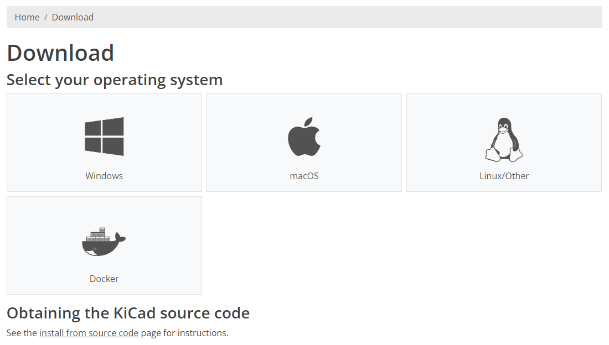

On the next page, you can **select** from **which server to download** the installer. I recommend you to download it with **GitHub** because it is the most reliable and works for everyone.

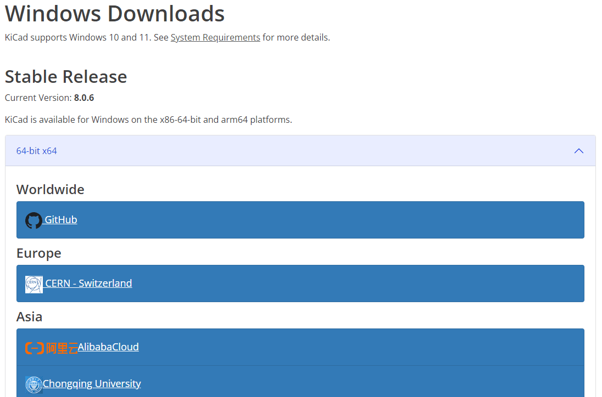

## Installing KiCad 8.0 step by step

**1.** First open the **installer** that you just downloaded and click **Next**

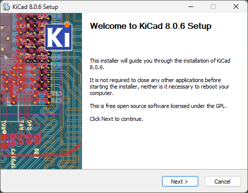

**2.** Select if you want to install KiCad **only for your user or for all users**. I **recommend** that if it is for your personal computer you install it for **all users.** Click **Next** and when it asks for administrator permissions grant them.

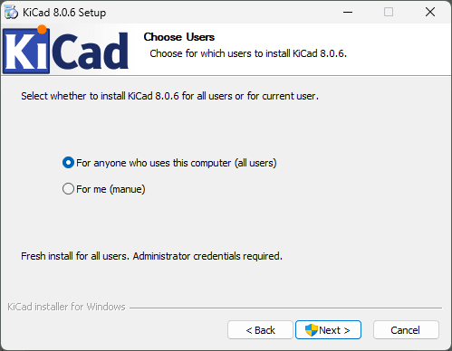

**3.** In this menu you can select if you want to** install the component libraries that KiCad comes with by default**. I **recommend** you to install them if you are starting to use KiCad or to learn about electronic design, since you will have already created components.

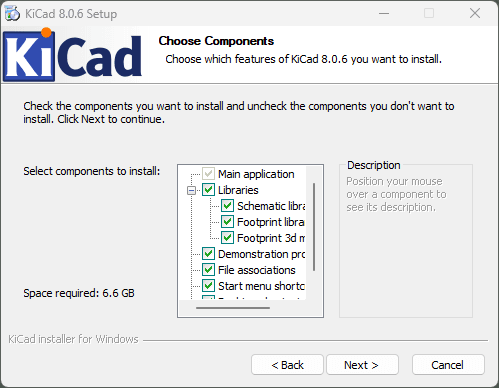

**4.** In the following menu you can select in** which folder KiCad is installed.** In general, you don't have to change the **default path.** Click Install and KiCad will start installing.

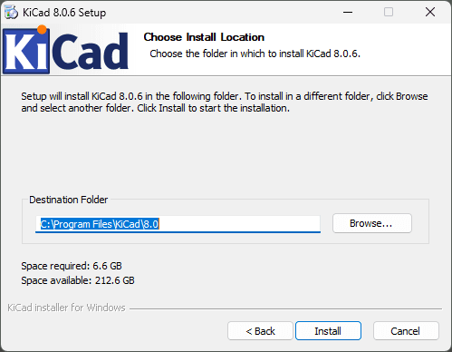

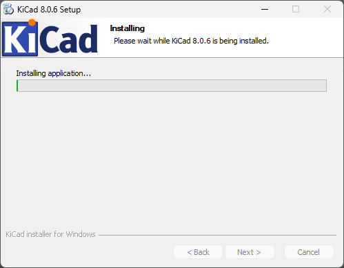

**5.** Once installed you can **open KiCad and start designing!**

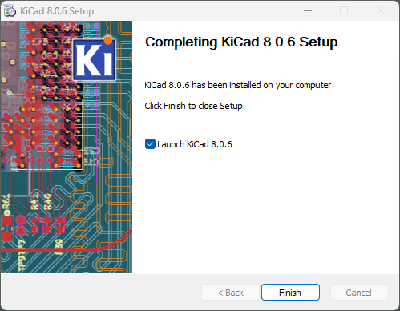

## Tips for the first time you open KiCad

As soon as you open KiCad you will get this **pop up**. If this is the first time you install KiCad I **recommend you to select “Start with default settings”. **The other option is to import the settings from a previous version of the program that you have installed on your computer.

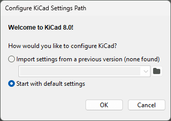

Then you will have to choose if you want to **send usage data to improve the program and report program crashes automatically. **I **recommend** that you choose **Yes** so that they can continue to improve the program.

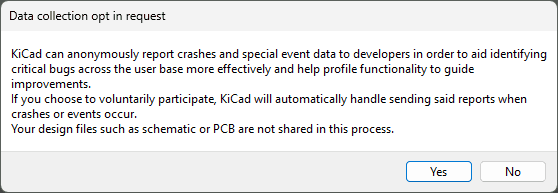

The first time you** open the Schematic Editor or the Symbol Editor **you will get this** pop up **to configure the Libraries. I recommend that you choose the first option to have the **default KiCad symbols available.**

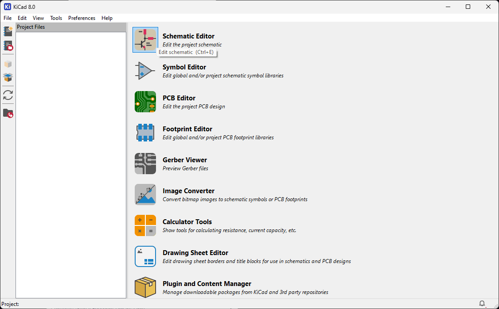

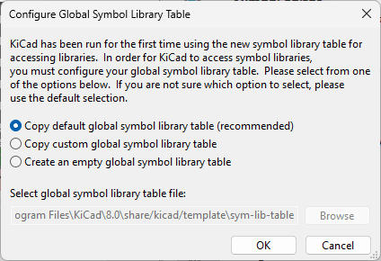

Likewise, the first time you open the **PCB Editor or the Footprint Editor **you can choose whether you want to have the** default KiCad footprints.**

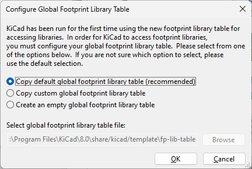

## Conclusions

By following this guide you are all set to **create your designs using KiCad 8.0** 🚀

If this is your **first time using KiCad** you will see how **intuitive** and **easy to use **it is.

