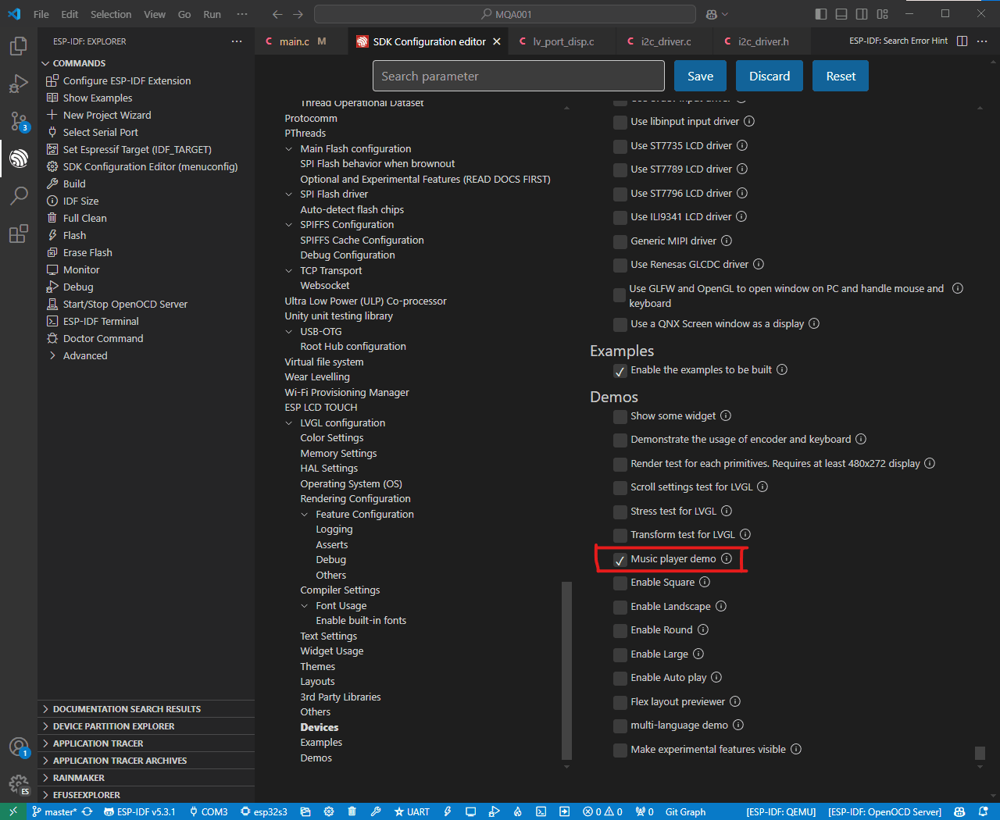

En esta **segunda parte del tutorial** vamos a configurar el **driver i2c, la pantalla táctil y vamos a iniciar LVGL.**

Cuando termines el artículo, vas a ser capaz de ejecutar uno de los ejemplos por defecto que trae LVGL:


Vamos a continuar donde lo dejamos en la primera parte del tutorial. **Si no has leido la primera parte de la dejo en el siguiente enlace:**

****[Parte 1: Cómo configurar una pantalla para usar LVGL con ESP-IDF](https://mquero.es/blog/how-to-configure-a-diplay-for-LVGL)

## Mi Configuración

Estoy usando la siguiente c**onfiguración de componentes y versiones**. Aunque no estes usando los mismos componetes o la misma versión de ESP-IDF, no te preocupes porque seguramente te funcione a ti también.

- Microcontrolador: ESP32-S3-WROOM-2
- Pantalla táctil de 2 pulgadas 320x240
- 
- 
- ESP-IDF 5.3.1
- LVGL 9.2.2

En el siguiente repositorio de **GitHub**, os podeis **descargar y copiar el codigo completo del artículo**, por si lo quereis tener entero ya a mano.  

****[Repositorio de GitHub](https://github.com/mquerostudio/blog-articles/tree/master/MQA001)

Vamos a ir escribiendo el código **poco a poco y explicándolo.**

## Configurar I2C

Primero de todo, vamos a **configurar el i2c** para **comunicarnos con el driver táctil de la pantalla **y** **para poder usarlo.

Vamos a crear **dos archivos nuevos** en la misma carpeta que el main.c.

- i2c_driver.h

```c

```

- i2c_driver.c

```c

```

Estos dos archivos nos van a permitir inicializar el** bus i2c** mediante la función `**i2c_init(void)**`**,** y lo vamos a poder controlar mediante su **manejador **`**i2c_bus_handle**`, que lo vamos a tener disponible poque en el** archivo de cabecera** lo hemos declarado como `**extern**`.

**Importante que modifiques los *****DEFINES *****en el archivo fuente para configurar los pines a tu placa o configuración.**

En otro tutorial ya os contaré sobre el **driver i2c** y toda su **configuración**. Por ahora, con estos dos archivos **nos funcionará todo**.

Para usar el **táctil de la pantalla y que funcione con LVGL**, vamos a configurarlo basándonos en las **plantillas **que tiene la **documentación de LVGL.**

****[Plantillas de LVGL](https://github.com/lvgl/lvgl/tree/master/examples/porting)

Como hicimos con la pantalla en la primera parte del tutorial, vamos a crear dos nuevos archivos,** lv_port_indev.h** y **lv_port_indev.c**

Estos dos archivos se van a encargar de **iniciar el táctil de la pantalla** y **configurar LVGL **para que lo use.

## Archivo de Cabecera lv_port_indev.h

Vamos a escribir este código:

```c

```

Primero, añadimos la** información del archivo** y los*** include guards*** para **evitar **la **inclusión multiple del archivo de cabecera**.

En el apartado ***INCLUDES***, añadimos el archivo de caberera **esp_lcd_touch.h**, que nos va a permitir en el apartado ***VARIABLES ***declarar la variable `**tp_handle**`** **de tipo `**esp_lcd_touch_handle_t**`. 

Esta variable, va a ser el manejador del táctil. Si no sabes qué es un manejador, en la** primera parte del tutorial lo explico** (y si no pregúntale a ChatGPT que explica mejor que yo🤪).

La palabra `**extern**`** **sirve para poder acceder al manejador desde otros archivos que tengamos en el proyecto.

En el apartado ***GLOBAL PROTOTYPES*** vamos a declarar la **única función global** que vamos a necesitar `**lv_port_indev_init**`. Esta función se va a encargar de inicializar el táctil y **registrarlo en LVGL**.

## Archivo fuente lv_port_indev.c

Cómo este archivo es mucho más largo,** vamos por partes.**

```c

```

Vamos a empezar escribiendo la** información básica **del archivo y luego, en el apartado ***INCLUDES***, vamos a añadir los siguientes archivos de cabecera:

- lv_port_indev.h para incluir el archivo de cabecera anterior.
- i2c_driver.h para incluir el archivo donde hemos configurado el i2c.
- esp_lcd_touch_cst816s.h para configurar nuestro táctil.
- lvgl.h para utilizar la libreria de LVGL.

Luego en el apartado ***DEFINES***, vamos a definir la **resolución horizontal** y **vertical de la pantalla** y los pines de **interrupción **y **reset**. En mi caso, mi pantalla es de **240x32**0 y **no tengo pines de interrupción ni de reset.**

En el apartado ***VARIABLES***, vamos a definir el **manejador de la pantalla** y lo vamos a inicializar con `**NULL**`.

Para el apartado de*** STATIC VARIABLES*** vamos a crear la variable `**indev_touchpad**`, que es un puntero de tipo `**lv_indev_t**`. Esta variable va a ser el manejador que utilice LVGL.

Vamos a declarar** dos prototipos de funciones** en el apartado ***STATIC PROTOTYPES:***

- touchpad_init(void)

- touchpad_read(lv_indev_t *indev, lv_indev_data_t *data);

Estas dos funciones nos van a servir para** iniciar y leer el táctil**. Más adelante entraremos a definirlas.

Vamos a seguir escribiendo el siguiente código:

```c

```

Aqui declaramos la única función global que tenemos.

1. Inicializamos el táctil con touchpad_init();
2. Con lv_indev_create() creamos un nuevo dispositivo de entrada para LVGL.
3. Con lv_indev_set_type le decimos a LVGL que es de tipo puntero mediante LV_INDEV_TYPE_POINTER.
4. Configuramos con lv_indev_set_read_cb  nuestro callback, que es nuestra función que lee el táctil.

Vamos ahora a definir nuestras **dos funciones estáticas:**

```c

```

Primero, vamos a definir `**touchpad_init**` para inicializar el **táctil**. Vamos paso por paso.

Creamos una variable llamada `**tp_io_handle**` de tipo `**esp_lcd_panel_io_handle_t**` y la inicializamos con `**NULL**`.

Creamos otra llamada `tp_io_config` de tipo `**esp_lcd_panel_io_i2c_config_t**`** **y la inicializamos con la **configuración que nos da la libreria de nuestro táctil**. Además, como es una **estructura**, configuramos la **velocidad del i2c** accediendo a la variable `**scl_speed_hz**`.

Usando `**esp_lcd_new_panel_io_i2c**`, configuramos todo, pasándole el manejador del bus i2c, la configuración y el manejador.

Ahora vamos a configurar el táctil, creando una nueva variable llamada `**tp_cfg**` de tipo `**esp_lcd_touch_config_t**`. Igual, como es una estructura vamos configurando las **variables internas una por una.**

Para terminar esta función, mediante `**esp_lcd_touch_new_i2c_cst816s**`, configuramos nuestro manejador del táctil `**tp_handle**`.

Vamos ahora con la función que lee en **qué punto hemos tocado la pantalla**:

```c

```

Primero creamos tres variables:

- touch_x[1], que guardará la coordenada x

- touch_y[1], que guardará la coordenada y
- touch_cnt, que guardará con cuantos dedos se ha tocado la pantalla.

Como sólo vamos a habilitar que la pantalla se pueda tocar con un** solo dedo**, la longitud de los **vectores **es **1** y inicializamos `**touch_cnt**` en **0**.

Luego mediante la función `**esp_lcd_touch_read_data**` leemos el panel táctil. Esta función nos la da la librería **esp_lcd_touch.h.**

Luego mediante `**esp_lcd_touch_get_coordinates**` leemos las **coordenadas **de donde se ha tocado la pantalla. **Si se ha tocado, devolverá las coordenadas y sino, devolverá 0.**

Sabiendo esta **condición**, se puede hacer el** if/else**. Si se ha **pulsado**, se **modifica el estado** y se actualiza a `**LV_INDEV_STATE_PRESSED**` y accediendo a `**point.x**` y a `**point.y**` se pasan las **coordenadas x e y** respectivamente.

**Si no se ha pulsado**, se actualiza el estado a `**LV_INDEV_STATE_RELEASED**`.

Con todo esto, el archivo **lv_port_indev.c **tiene que quedar así:

```c

```

**¡Enhorabuena ya casi lo tenemos!** Vamos a configurar el **main.c** para mostrar una **demo de LVGL** en la pantalla🚀

## Configurar main.c

Antes de nada, vamos a abrir el **SDK Configuration Editor** y vamos a seleccionar la casilla de **"Music player demo"**



Empecemos escribiendo el **main.c** con lo siguiente:

```c

```

**Como hemos hecho antes,** primero escribimos la **información básica** del archivo y luego en ***INCLUDES ***añadimos los archivos de cabecera:

- i2c_driver.h para poder iniciar el bus i2c.
- lv_port_disp.h, para iniciar la pantalla.
- lv_port_indev.h, para iniciar el táctil.
- lvgl.h, para utilizar la libreria LVGL.
- esp_lcd_panel_ops.h, para poder encender la pantalla.
- esp_timer.h para controlar el tiempo del LVGL.
- lv_demos.h para usar una demo.

Luego vamos a escribir dos variables:

1. xGuiSemaphore de tipo SemaphoreHandle_t. La vamos a utilizar para controlar el acceso a los recursos de la tarea que va a controlar la interfaz gráfica.
2. gui_task_handle de tipo TaskHandle_t. Va a ser la tarea donde vamos a iniciar la interfaz gráfica y LVGL.

En el apartado `**STATIC PROTOTYPES**` vamos a declarar dos prototipos, `**lv_tick_task**` y `**task_gui**`. Cuando las definamos más adelante os explico para que sirven.

```c

```

**Ánimo que queda poco **🙌

En el **app_main** vamos a hacer** tres cosas rápidas:**

1. Creamos un semáforo de tipo Mutex para proteger el acceso a las funciones de LVGL (cuando lo usemos más adelante vais a ver para qué sirve).
2. Iniciamos el bus i2c con i2c_init.
3. Creamos la tarea "gui" y la enlazamos con la función task_gui que hemos declarado antes. Además, le damos una pila de datos de 18 KB, una prioridad de 5 y le decimos que se ejecute en el núcleo 1 del ESP32-S3. También, guardamos el identificador de la tarea en gui_task_handle.
4. Creamos un bucle infinito con un tiempo de espera de 1000 milisegundos. Esto lo hacemos para que la aplicación nunca termine.

**Vamos a lo último** 🚀

```c

```

La función `**lv_tick_task(void)**` la vamos a utilizar para que nos **devuelva el tiempo actual en microsegundos** desde que se** inició el sistema. **La necesitamos porque **LVGL **necesita realizar un** seguimiento del tiempo.**

Como LVGL necesita que el tiempo se exprese en **milisegundos**, **dividimo**s el valor devuelto por `**esp_timer_get_time()**` entre **1000**.

La función `**task_gui(void *arg)**` se va a encargar de **gestionar de manera continua la interfaz gráfica.**

Primero, con **lv_init()** inicializamos la librería **LVGL**, **po ley** tiene que llamarse antes de usar cualquier otra función de LVGL.

Luego configuramos la función `**lv_tick_task**`, que hemos creado antes, para que la use LVGL para medir el tiempo.

Con `**lv_port_disp_init()**` y `**lv_port_indev_init()**` inicializamos tanto la **pantalla como su táctil.**

Arrancamos la demo con `**lv_demo_music()**` y **encendemos la pantalla** con `**esp_lcd_panel_disp_on_off**`.

Ya solo queda hacer el bucle que se va a** encargar de actualizar continuamente la interfaz gráfica.** Para eso, dentro del bucle `**while**`, creamos un condicional.

**Si el semáforo está libre** y conseguimos cojerlo, **entramos al condicional**. Dentro de este llamamos a `**lv_timer_handler()**`, que se va a encargar de **manejar las taréas periódicas de LVGL**. Además, esta función devuelve el **tiempo en milisegundos** hasta la próxima vez que debe **ejecutarse**.

Por último, **devolvemos el semáforo** con `**xSemaphoreGive**` y esperamos el tiempo que nos ha devuelto `**lv_timer_handler**`.

## Test Final

**¡Ya hemos terminado de escribir todo el código!**

Si todo sale bien, cuando **compiles y subas** el código al ESP32-S3, tienes que empezar a ver la **demo de música** que trae por defecto **LVGL**.


Ha sido un **tutorial largo**, pero a partir de ahora ya tendrás todo listo para **implementar LVGL en tus proyectos**🙌

Recuerda que puedes seguirme en mis **redes sociales** buscando **@mquerostudio** y en mi canal de** YouTube @MQuero.**

Si has encontrado alguna **errata **en el artículo o crees que se puede hacer **alguna mejora** mandame un **mensaje **por alguna de mis redes y lo **comentamos **🤝

**:)**

