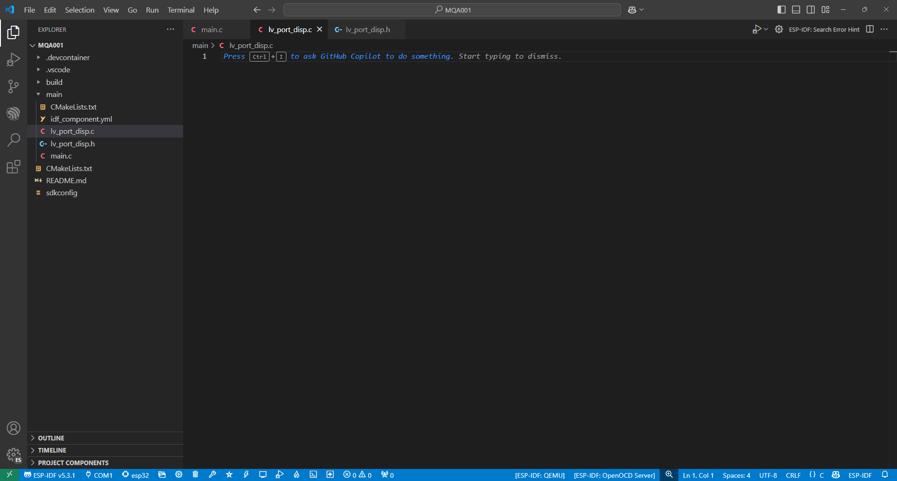

## Mi Configuración

Para este **tutorial**, he usado la siguiente **configuración de componentes y versiones.** Si no estas usando estos mismos componentes o usas una versión distinta de ESP-IDF, no te preocupes, porque estoy casi seguro que te va a funcionar igual.

- Microcontrolador: ESP32-S3-WROOM-2

- Pantalla táctil de 2 pulgadas 320x240
- 

- ESP-IDF 5.3.1

- LVGL 9.2.2

## Crear Nuevo Proyecto

He creado un **nuevo projecto** para enseñarte todo **desde cero**. Si tu ya tienes un proyecto creado sigue leyendo en el siguiente apartado para añadir las librerías necesarias.


Tras crear el nuevo proyecto nuestro** main.c** se tiene que ver asi:

```c

```

Recuerda **configurar** tu microcontrolador mediante el** SDK Configuration Editor.**


## Librerías Necesarias

Para **controlar el táctil **de la pantalla vamos a añadir al proyecto las** dos siguientes librerías:**

****[esp_lcd_touch](https://components.espressif.com/components/espressif/esp_lcd_touch/versions/1.1.2)****

****[esp_lcd_touch_cst816s](https://components.espressif.com/components/espressif/esp_lcd_touch_cst816s/versions/1.0.3~1)

Si tienes un** integrado para el táctil distinto,** en vez de usar la librería **esp_lcd_touch_cst816s,** puedes buscar en la siguiente página una librería para el tuyo:

[ESP Component Registry](https://components.espressif.com/)

Para **añadirlas** haz lo siguiente:

1. Abre una **terminal ESP-IDF**


2. En la** terminal copia el comando que se indica en la página de la librería**. Te tiene que quedar algo asi:


De la misma manera, hay que **añadir la librería de LVGL en el proyecto**. En el siguiente enlace tienes el **comando** para añadirla por la terminal:

[lvgl](https://components.espressif.com/components/lvgl/lvgl)

Seguramente te estarás preguntando, **¿y no necesito añadir una librería para controlar la pantalla?**

La respuesta es **SI**, pero una ventaja de usar** ESP-IDF** es que trae muchas **implementaciones por defecto.** Esto básicamente significa que **ya lleva incluido librerías** para los principales **drivers de pantallas.**

## Configuración de la pantalla

Para no tener un **único archivo con una montón de codigo que no se entienda nada**, vamos a configurar la pantalla en un **nuevo archivo llamado lv_port_disp. **Crea los siguientes archivos con estos nombres:

- lv_port_disp.h: el archivo de cabecera donde vamos a declarar las funciones que usemos.

- lv_port_disp.c: el archivo fuente donde vamos a definir las funciones.

Estos dos archivos van a estar preparados para, en la **segunda parte del artículo, aprender a usar LVGL **y están basados en las **plantillas **del siguiente enlace:

[Plantillas de LVGL](https://github.com/lvgl/lvgl/tree/master/examples/porting)

Crea los archivos de forma que esten en el mismo directorio que el **main.c.**



En el siguiente repositorio de GitHub os podeis **descargar y copiar el codigo completo del artículo** por si lo quereis tener entero ya a mano, pero vamos a ir** escribiendo el código poco a poco y explicándolo.**

****[Repositorio de GitHub](https://github.com/mquerostudio/blog-articles/tree/master/MQA001)

## Archivo de Cabecera lv_port_disp.h

El** archivo de cabecera nos va a servir para declarar las funciones y variables globales** que vayamos a usar en otros archivos.

Vamos a empezar el archivo escribiendo el siguiente código:

```c

```

Primero añadimos** información sobre el archivo**, como el nombre del archivo y una pequeña descripción.

El código de las lineas 8 y 9  es un **patrón de programación llamado "include guard",** que se utiliza para** evitar la inclusión multiple** de una archivo de encabezado y **evitar errores de compilación**. No es obligatorio pornerlo pero es bueno coger la **costumbre**. **Si lo pones recuerda añadir al final del archivo la siguiente línea:**

```c

```

En el apartado ***INCLUDES***, vamos a añadir el archivo de cabecera **esp_lcd_types.h**, que nos va a permitir en el apartado ***VARIABLES ***declarar la variable `**panel_handle**`** **de tipo `**esp_lcd_panel_handle_t**`. Esta variable la **definiremos en el archivo fuente** más adelante y os explicare **qué es un manejador.**

La palabra `**extern**`** **delante de la declaración de la variable permite poder acceder a ella desde otros archivos que tengamos en nuestro proyecto. 

Luego vamos a escribir debajo el **siguiente código:**

```c

```

En este apartado, vamos a **declarar los prototipos de las funciones globales**. Solo vamos a declarar `**lv_port_disp_init**` que se va a encargar de** inicializar el driver** para usar la pantalla con **LVGL**.

El archivo **lv_port_disp.h** te tiene que quedar asi:

```c

```

## Archivo fuente lv_port_disp.c

En este archivo fuente, vamos a añadir todo lo necesario para **configurar el driver de la display para LVGL.** Vamos a **empezar **añadiendo los siguiente:

```c

```

Primero, añadimos la** información básica** sobre el archivo que estamos escribiendo.

Luego, en el apartado de ***INCLUDES***, añadimos las librerias que vamos a utilizar:

- lv_port_disp.h para incluir el archivo de cabecera anterior.

- lvgl.h para utilizar la libreria de LVGL.

- driver/spi_master.h para controlar el bus SPI del ESP32 al que está conectada la pantalla.

- esp_lcd_panel_io.h para manejar la interfaz de Entrada/Salida (ES) de la pantalla.

- esp_lcd_panel_vendor.h para usar la pantalla con el driver ST7789.

- esp_lcd_panel_ops.h para usar las funciones que controlan la pantalla.
- esp_heap_caps.h para poder guardar los búferes en la SPRAM.

Luego, vamos a escribir el **siguiente código:**

```c

```

Vale, vamos a empezar por el apartado de los ***DEFINES***:

- CONFIG_LCD_HOST: definimos que periferico SPI queremos usar. Te recomiendo usar el SPI3.

- El siguiente bloque de los defines configura a qué pines está conectada la pantalla. Modifícalo para tus conexiones.

- Con CONFIG_LCD_H_RES y CONFIG_LCD_V_RES, configuramos la resolución horizontal y vertical de nuestra pantalla, respectivamente. Si tienes una resolución distinta, modifícalo.

- CONFIG_LCD_FREQ configura la frecuencia a la que funciona nuestra pantalla. La mía funciona correctamente a 80 MHz, aunque le puedes bajar la frecuencia a 40 MHz o 20 MHz si tienes algún problema.

- CONFIF_LCD_CMD_BITS y CONFIG_LCD_PARAM_BITS configuran el número de bits utilizados para los comandos y los parámetros que se envían a la pantalla. Déjalo en 8 bits; es muy raro que lo tengas que cambiar.

- BYTE_PER_PIXEL define el número de bytes necesarios para representar un píxel en un formato RGB565. Lo utilizaremos más adelante para crear los búferes.

Pasando al apartado ***VARIABLES***, solo tenemos que definir el **manejador de la pantalla**. Es de tipo `esp_lcd_panel_handle_t `y vamos a inicializarlo con un valor de `NULL`.

Esta **variable **es un **manejador que va a representar a nuestra pantalla en el código,** y por el accederemos a controlarla. No te preocupes si no lo entiendes muy bien, porque es un concepto más avanzado que se va **aprendiendo con el tiempo :)**

En el apartado de*** STATIC PROTOTYPES***, vamos a **declarar los prototipos de las funciones estáticas** que usaremos en este archivo. Más adelante te explicaré para que se utilizan.

Vamos a lo **divertido **y vamos a escribir la **única función global que necesitamos:**

```c

```

Esta función se encarga de **configurar e inicializar la pantalla utilizando LVGL.** Te explico parte por parte:

```c

```

Aquí, se llama a la **función estática** `disp_init()` que veremos más adelante. Se encarga de **configurar **y poner en marcha el** hardware de la pantalla.**

```plaintext

```

- Con lv_display_create, creamos una nueva variable que representa la pantalla con la resolución especificada por CONFIG_LCD_H_RES y CONFIG_LCD_V_RES.  Esta función inicializa una nueva pantalla en LVGL y devuelve un puntero a esta pantalla, que se almacena en la variable disp.

- Con la función lv_display_set_flush_cb, enlazamos nuestra variable disp a nuestra función estática disp_flush. Basicamente, hacemos que la función  disp_flush se convierta en un callback encargado de transferir el contenido del búfer de disp desde LVGL a la pantalla física. Esto significa que cada vez que LVGL necesita actualizar el contenido de la pantalla, llama automáticamente a disp_flush.

```c

```

En esta parte del código, creamos **dos búferes** para almacenar los **datos gráficos** que se muestren en la pantalla.

Con `**LV_ATTRIBUTE_MEM_ALIGN**`** **aseguramos que los búferes `buf1` y `buf2` estén **alineados en la memoria**. Haciendo esto garantizamos que el acceso a sus datos sea **eficiente **y compatible con el hardware. Esto me lo he sacado de **ChatGPT **porque no sabia para que servía jajaja

Luego, creamos los **búferes **de tipo `uint8_t` y configuramos su tamaño para almacenar un **frame completo**. Esto se calcula con `**CONFIG_LCD_H_RES * CONFIG_LCD_V_RES * BYTE_PER_PIXEL**` que como os he explicado antes `BYTE_PER_PIXEL` define cuántos bytes se necesitan para representar un píxel en formato RGB565.

Además, usando la función `heap_caps_malloc` seleccionamos que a los búferes se les asigne la memoria PSRAM mediante `MALLOC_CAP_SPIRAM`.

Por último, con la función `**lv_display_set_buffers**`** **se asignan los dos búferes a la pantalla creada y hacemos que el modo de representación gráfica sea `LV_DISPLAY_RENDER_MODE_FULL` aprovechando que usamos la PSRAM.

Vamos a empezar a escribir las** funciones estáticas** con la función `**disp_init**`** **que se encarga de **inicializar la pantalla y los periféricos necesarios. **Este es el código completo de la función:

```c

```

A primera vista, se puede ver **complicado **asi que voy explicandolo **paso por paso.**

```c

```

Primero, **configuramos el bus SPI** definiendo la variable `bus_cfg` de tipo `spi_bus_config_t`, que es una **estructura**. Así podemos ir accediendo a las** variables internas** de esta estructura y **configurarlas **según nos interesa.

- sclk_io_num y mosi_io_num son los pines que se utilizan para el relog y la línea de datos.

- quadwp_io_num y quadhd_io_num los configuramos como -1 porque voy a usar el SPI clásico.

Luego, mediante la función `**spi_bus_initialize**`, inicializamos el bus SPI, pásandole **tres parámetros:**

1. El bus SPI que queremos, con CONFIG_LCD_HOST, que se convierte mediante un cast a spi_host_device_t.
2. La variable bus_cfg, usando "&" porque es una variable de tipo estructura, y necesitamos pasar su dirección de memoria.
3. SPI_DMA_CH_AUTO para habilitar el uso de DMA (Direct Memory Access) y elegir un canal automático (no preguntes para que sirve porque es una fumada explicarlo, confia que así va más rápido).

Esta función la metemos en `ESP_ERROR_CHECK` para verificar si se ejecuta correctamente y si hay un **error se aborta el programa.**

Con el siguiente código vamos a **configurar las entradas y salidas necesarias** para la comunicación con la pantalla.

```c

```

Primero, creamos una variable llamada `io_handle` de tipo `esp_lcd_panel_io_handle_t`, que se va a encargar de manejar la **interfaz de comunicación SPI con la pantalla**. Vamos a inicializala en `NULL` por seguridad.

Luego, tenemos que crear una nueva variable llamada `io_cfg` de tipo `esp_lcd_panel_io_spi_config_t`, que como es una estructura, vamos a configurar sus **variables internas**:

- dc_gpio_num y cs_gpio_num son los pines de Data/Command y Chip Select de la pantalla.

- pclk_hz es la frecuencia de reloj SPI de la pantalla.

- lcd_cmd_bits y lcd_param_bits ya hemos explicado antes para lo que sirven.

- spi_mode configura el modo SPI. De base 0 va bien.

- trans_queue_depth es el tamaño de cola de transacciones SPI. Básicamente determina cuántas transacciones se pueden poner en cola simultáneamente. Diez es un buen valor.

Y ya mediante la función `esp_lcd_new_panel_io_spi` dejamos esta parte configurada. Aqui **no hay nada raro**, es casi igual que antes y también comprobamos errores con `ESP_ERROR_CHECK`.

Ya casi terminamos esta parte, **vamos a configurar la pantalla**.

```c

```

El procedimiento es **similar**. Creamos la variable `panel_cfg` de tipo `esp_lcd_panel_dev_config_t`, y como es una **estructura **configuramos las **variables internas **de esta manera:

- reset_gpio_num es el pin de reset de la pantalla.

- rgb_ele_order define el orden del RGB. En mi caso es LCD_RGB_ELEMENT_ORDER_RGB pero si ves que la pantalla te muestra otros colores puedes cambiarlo por LCD_RGB_ELEMENT_ORDER_BGR.

- bits_per_pixel especificamos el número de bits por píxel. Es 16 porque para el formato RGB565 son 5 bits para rojo, 6 bits para verde, y 5 bits para azul.

- data_endian, la pantalla puede usar LCD_RGB_DATA_ENDIAN_BIG o LCD_RGB_DATA_ENDIAN_LITTLE. Igual que antes, si ves que los colores que la pantalla te muestra son distintos a los que debería prueba a modificar esta variable.

Y de la misma forma que antes dejamos todo configurado con `**esp_lcd_new_panel_st7789**`** **y comprobamos que no hay errores con `ESP_ERROR_CHECK`.

Ya podemos **controlar la pantalla**, asique vamos a iniciarla siguiendo este ciclo.

```c

```

1. Reseteo.
2. Inicialización.
3. Invertir color: en mi caso le pongo que true para que se muestren bien los colores.
4. Configuramos que no se intercambie X e Y.
5. Configuramos que no se espeje la pantalla.
6. Por último dejamos la pantalla apagada para encenderla más adelante.

!Ya tenemos configurada e iniciada la pantalla! Queda escribir la **siguiente función estática** (esta es rápida lo prometo):

```c

```

Esta función nos sirve para **actualizar una parte específica de la pantalla** con el **contenido renderizado **en uno de los búferes que hemos creado antes.

1. Calculamos los offsets del área: offsetx1, offsetx2, offsety1, offsety2 se calculan a partir del área que LVGL necesita actualizar. Los valores x1, y1, x2, y2 especifican las coordenadas del área rectangular en la pantalla que debe actualizarse.
2. Llamamos a esp_lcd_panel_draw_bitmap para dibujar la imagen (bitmap) en la pantalla y le pasamso los datos.
3. Notificamos a LVGL de que se ha terminado de copiar la imagen y que puede seguir haciendo sus cosas.

Con todo el código, el **archivo lv_port_disp.c** tiene que quedar asi:

```c

```

!Enhorabuena! Si has llegado hasta aqui es porque has **sobrevivido al tutorial** 🚀

Como este artículo ha quedado un **poco largo y denso, voy a dividirlo**. En el siguiente artículo vamos a **terminar de configurar la pantalla para poder usar el táctil** y te voy a enseñar a **configurar LVGL** y hacerlo funcionar **paso por paso y explicando todo**. Y ya de paso ha hacer **una aplicación real** con un menú e implementar varios widgets como texto, botones y sliders.

Recuerda que puedes seguirme en mis** redes sociales** buscando **@mquerostudio** y en mi canal de **YouTube @MQuero.**

Si has encontrado alguna **errata **en el artículo o crees que se puede hacer **alguna mejora** mandame un **mensaje **por alguna de mis redes y lo comentamos 🙌

**:)**

