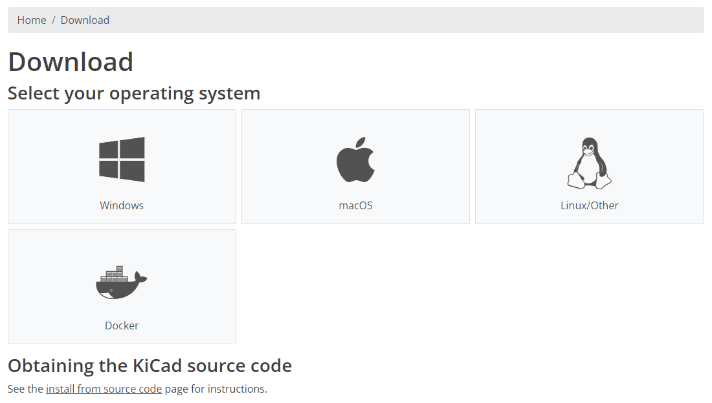
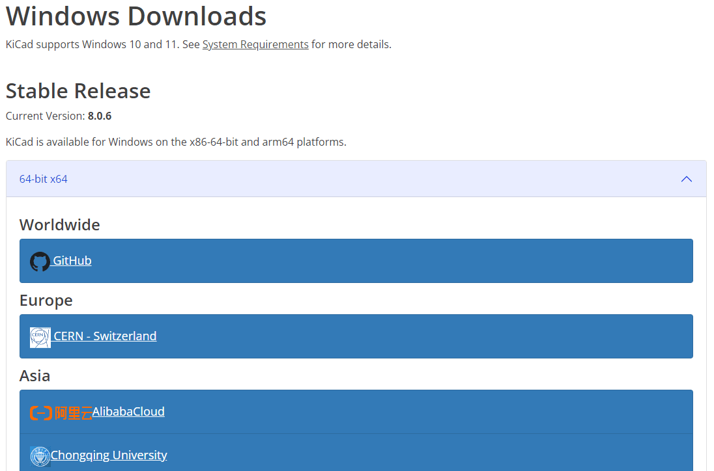
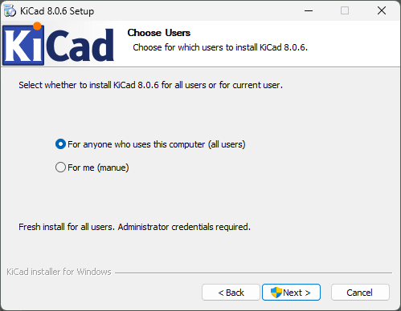
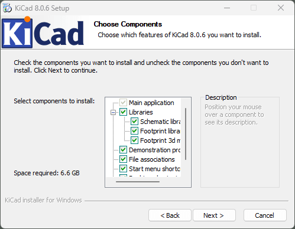
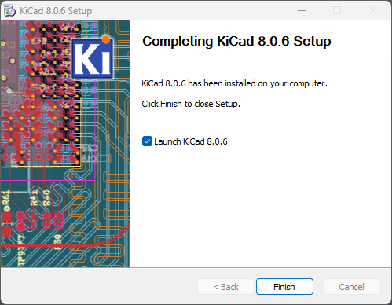
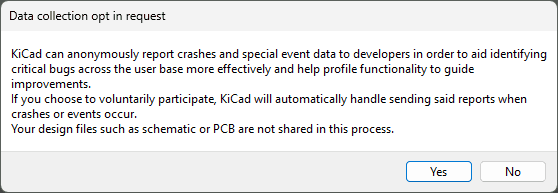
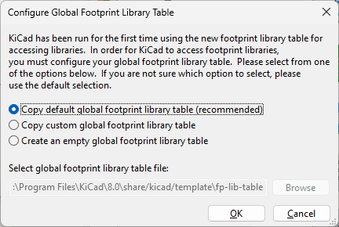

# ¿Qué es KiCad y por qué usarlo?

KiCad es una **herramienta de automatización de diseño electrónico (EDA)** de código abierto que se utiliza para crear **esquematicos** y** diseños de PCB** (placas de circuitos impresos). 

Es una de las opciones más populares entre la **comunidad electrónica y de makers** por todas las características que ofrece siendo **gratuita**.

Es ideal para** diseñar circuitos desde cero,** ya que permite a los ususarios ir desde la idea inicial hasta la fabricación y producción.

Una de las principales ventajas de **KiCad** es que es **Open Source**, pudiendo cualquier persona modificar y mejorar KiCad o añadiendo funcionalidades mediante **Plugins**. Estos plugins te pueden ayudar a automatizar tareas, agregar nuevas herramientas de diseño y mejorar la experiencia general del usuario. 

De echo, no tiene **nada que envidiar** a otros programas similares de **pago** como **Altium Designer o Cadence.**

## ¿Cómo descargar KiCad 8.0?

Para instalar KiCad, visita el [sitio oficial de KiCad](https://www.kicad.org/download/) y selecciona el sistema operativo que estés utilizando. En este tutorial te voy a explicar cómo instalarlo para **Windows**, aunque la instalación es idéntica para** Linux y macOS.**

En la siguiente página, puedes **seleccionar** desde qué** servidor descargar el instalador**. Te recomiendo que lo descarges con **GitHub** porque es el más fiable y que sirve para todo el mundo.

## Instalar KiCad 8.0 paso a paso

**1.** Primero abre el **instalador** que acabas de descargar y dale a **Next**

**2.** Selecciona si quieres instalar KiCad **solo para tu usuario o para todos los usuarios**. Te **recomiendo** que si es para tu ordenador personal lo instales para **todos los usuarios**. Dale a **Next** y cuando te pida permisos de administrador concedeselos.

**3.** En el siguiente menú puedes seleccionar si quieres **instalar las librerias de componentes que trae KiCad por defecto.** Te **recomiendo** que las instales si estás empezando a usar KiCad o a aprender sobre diseño electrónico,  ya que asi vas a tener componentes ya creados.

**4.** En el siguiente menú podrás seleccionar en **qué carpeta se instala KiCad**. En general, no hay que cambiar la **ruta por defecto** que trae. Dale a Install y KiCad se empezará a instalar.

**5.** Una vez instalado ya podrás **abrir KiCad y empezar a diseñar!**

## Consejos para la primera vez que abras KiCad

Nada mas abrir KiCad te saldrá este **pop up**. Si es la primera vez que instalas KiCad te **recomiendo que selecciones “Start with default settings”.** La otra opción es para importar los ajustes de alguna versión anterior del programa que tuvieras intalada en tu ordenador.

Luego tendrás que elegir si quieres **mandar datos de uso para mejorar el programa y reportar crasheos del programa automaticamente**. Te **recomiendo** que le eligas que **Sí** para que puedan seguir mejorando el programa.

La primera vez que habras el** Editor de Esquemático o el Editor de Symbolo **te saldrá este **pop up **para configurar las Librerias. Te recomiendo que eligas la primera opción para tener disponibles los **símbolos que trae KiCad por defecto.**

De igual forma, la primera vez que habras el **Editor de PCB o el Editor de Huella**s podrás elegir si quieres tener las huellas que trae por **defecto KiCad.**

## Conclusiones

Siguiendo esta guía ya tienes todo listo para **crear tus diseños usando KiCad 8.0 🚀**

Si es tu** primera vez usando KiCad** ya verás lo **intuitivo** y **sencillo** **de usar** que es. 

