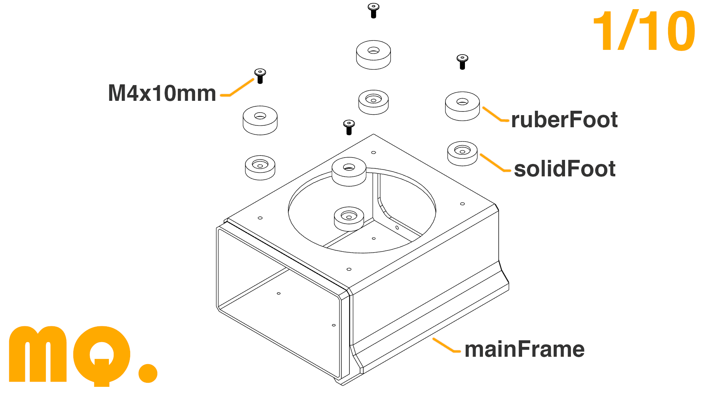
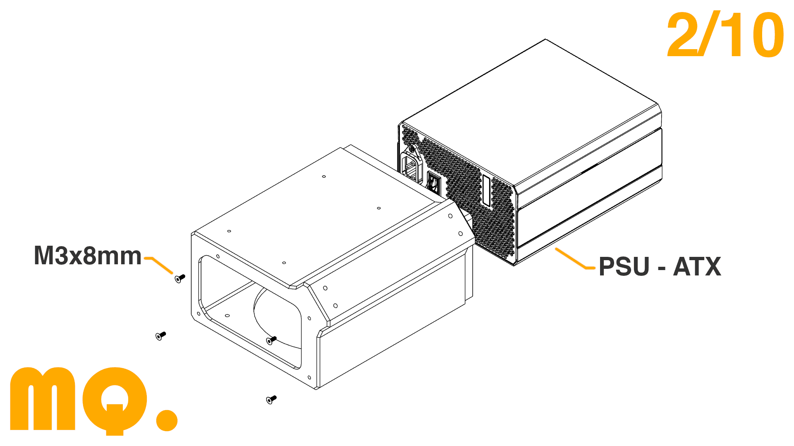
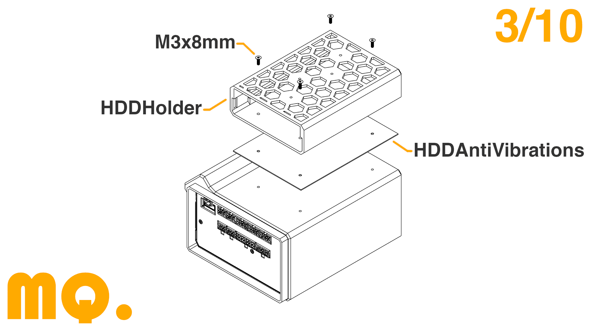
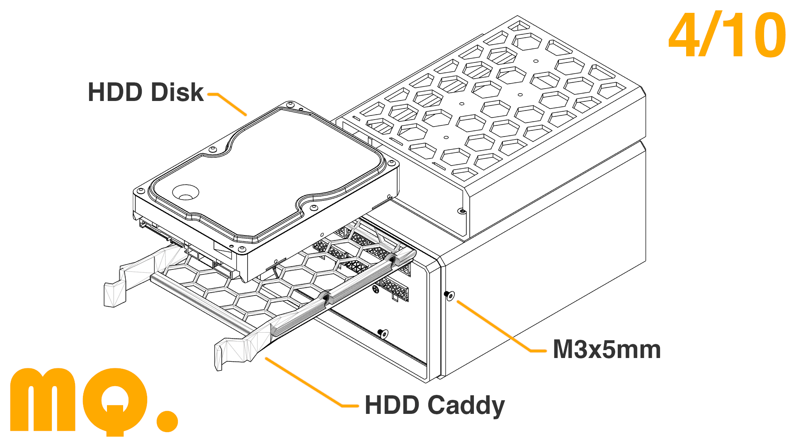
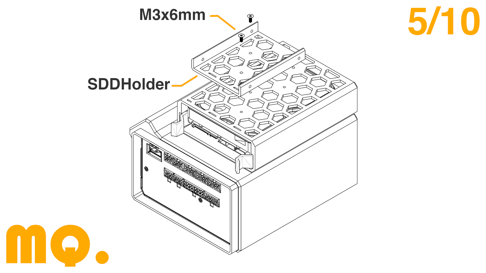
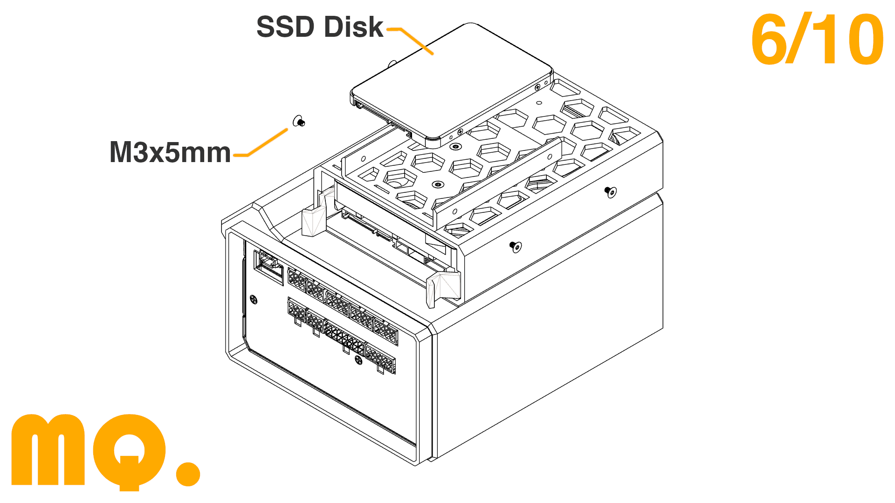
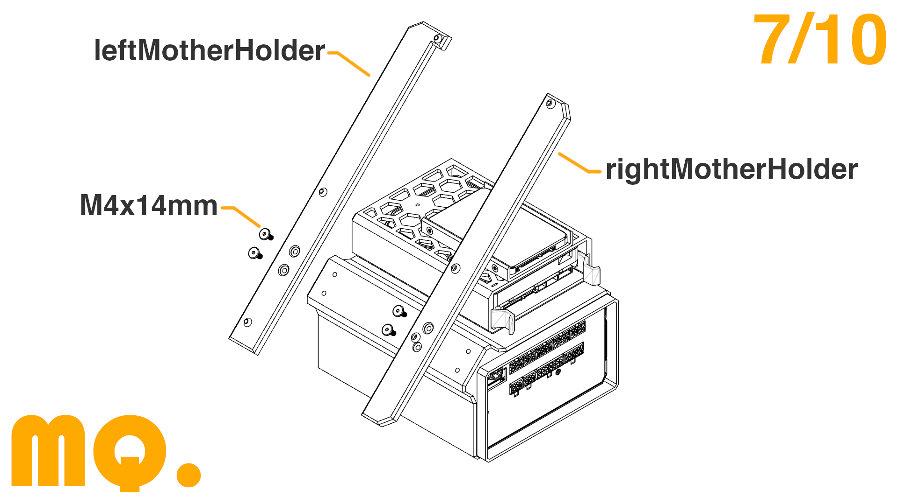
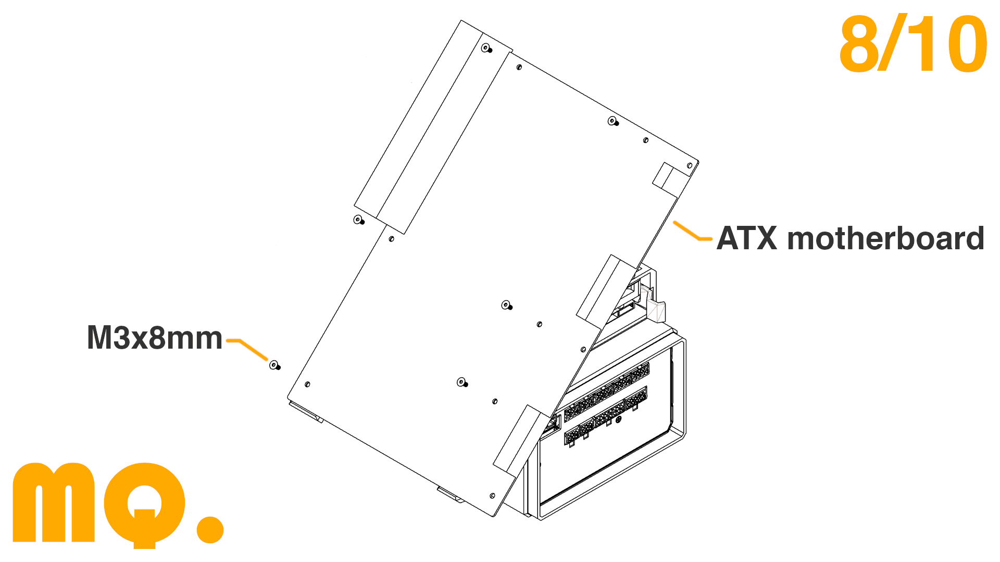
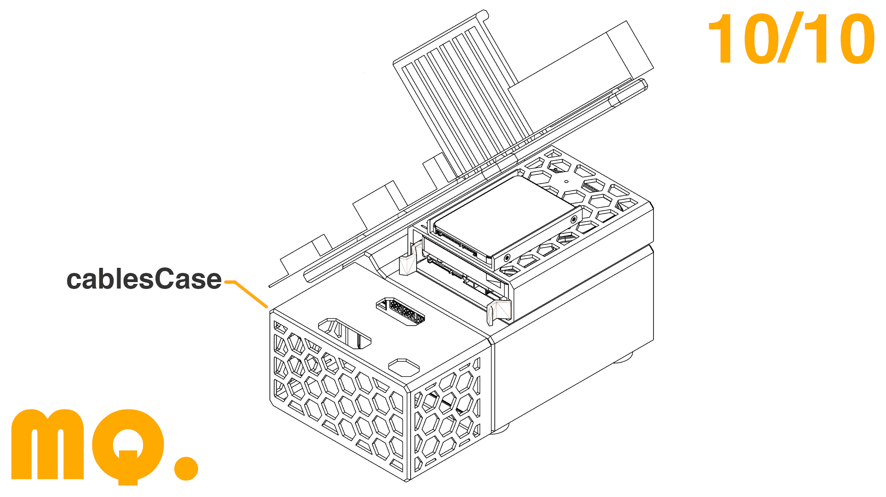

## Project Goal

The aim of the project has been to **design **an **open and modular structure for ATX **components. The structure is focused to use** X99 motherboards** for Intel Xeon and it is possible to mount** one HDD** and one **SDD disk**.

## Files

You can find all files to print the frame on this link:

- 

I recommend that you **print the parts using ABS or PETG** so that they do not suffer thermal deformation.

The files ***HDDAntiVibrations ***and ***4xrubberFoot ***are design to print them in **TPU **or **TPE**. If you don't have any of these materials, you can print the ***HDDAntiVibrations ***in **ABS **and the ***4xrubberFoot*** do not need to be printed.

For the **HDD Caddy**, you can print the [Squirtles HDD Caddy](https://www.printables.com/model/40826-35-generic-hdd-caddy)**.**

## Important information

The **two printed parts** where the motherboard is screwed are designed for the **Machinist MR9A PRO MAX**.

**If you have another motherboard** and you can't screw it correctly because the distance between the holes is different, **message me on Instagram with the distances you need** and I will upload the updated parts 🙌.

## Components

- Motherboard Machinist MR9A PRO MAX: 
- Processor Intel Xeon E5 2697A:  
- Cooling Block Teucer:  
- WiFi/Bluetooth card:  
- Dust Filter:  
- Screws: 

## Full YouTube Video

Following this link you can watch the** dedicated YouTube video:**

[https://www.youtube.com/watch?v=lF41ytBCWMM](https://www.youtube.com/watch?v=lF41ytBCWMM)

I have been able to make this project possible thanks to the **sponsor of PCBWay.**

PCBWay offers** 3D printing services, CNC and much more**, so you can manufacture any design you have without the need of having any machine in your house.

They are **specialized in PCBs manufacturing **offering boards from two layers at an **unbeatable price and quality.**

By registering at the following link you can get** $10 off** your first order: [https://www.pcbway.es/g/HLdIwJ](https://www.pcbway.es/g/HLdIwJ)

## Assembly

- Screw the four foots with M4x10mm screws. If you also printed the rubber foots, you can insert them after screwing.

- Insert the PSU inside the main frame and screw it with four M3x8mm screws.

- First, place the TPU spacer to avoid vibrations and then place the HDD Holder above it. Screw both with four M3x8mm.

- Screw the Caddy and the HDD with four M3x5mm screws and places the Caddy inside the HDD Holder.

- Screw the SDD Holder above the HDD Holder with two M3X5mm screws.

- Screw the SDD Disk with M3x5mm screws.

- Screw both motherboard holders with four M4x14mm screws on the main frame.

- Place and screw the motherboard with M3x8mm screws.

- If you want to use any PCI card, screw the PCI Holder with seven M3x12mm screws.

- Wire everything and insert the cables case part.

## Social Media

- YouTube: 
- Intagram: 
- TikTok: 

