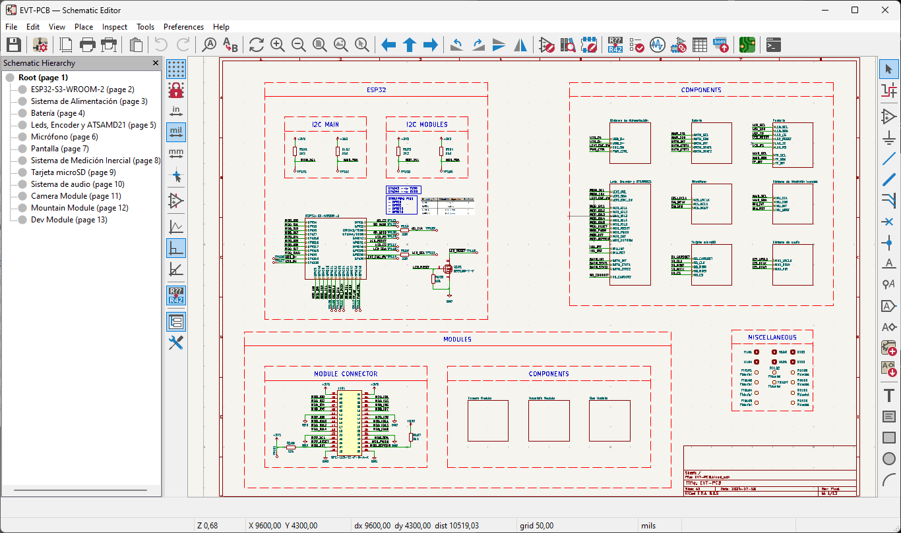
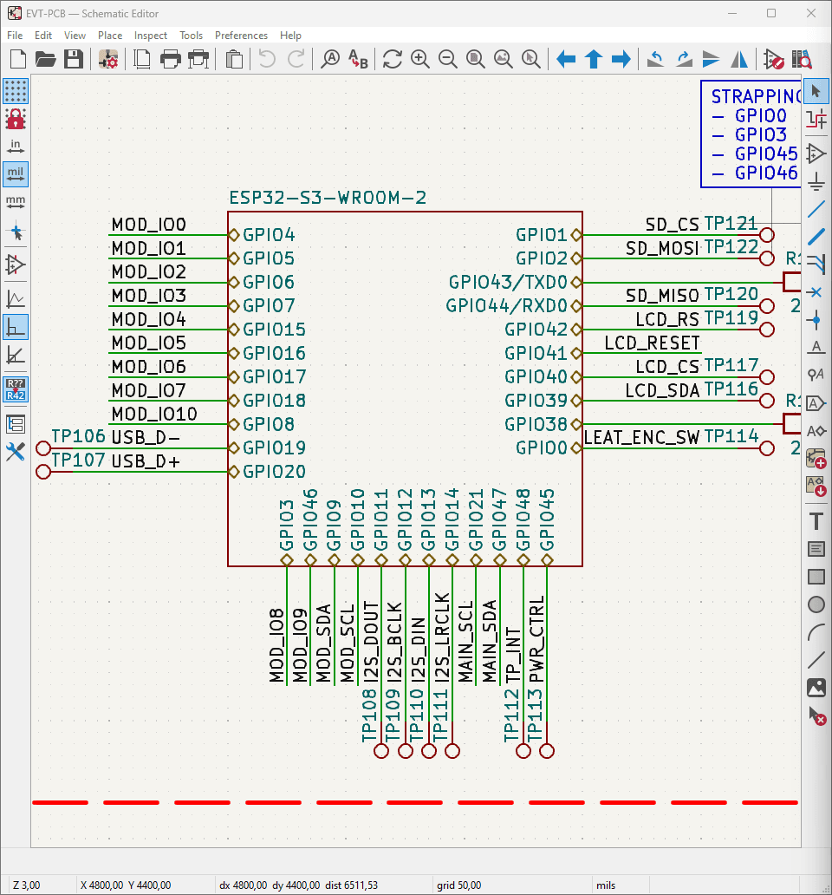
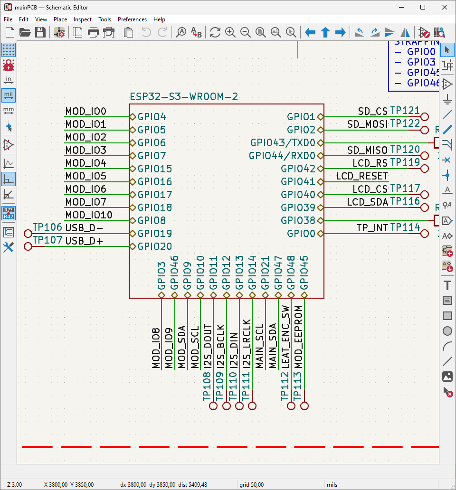

The project consisted of the development of the** MQ One**, a modular programmable electronic device, **from conception and design to validation and assembly.**

The MQ One has been conceived as a **development platform** for learning the** programming of embedded systems.** It implements the** most widely used components and sensors **in the world of electronics ready to be programmed.

It incorporates from **inputs and outputs**, with an encoder, a pushbutton and 24 LEDs, to more **advanced components**: display, Inertial Measurement Unit (IMU), microSD, microphone and speaker.

In addition, by means of a connector on the back, **additional modules can be connected**, allowing the connection of new sensors or features.

The MQ One is based on the **Espressif ESP32-S3**, a 24 MHz dual-core **32-bit microcontroller** with 32 MB of flash memory and 8 MB of PSRAM memory. It also has 2.4 GHz **Wi-Fi and Bluetooth 5 (LE) connectivity.**

The whole project is** Open Source** and the files are available in the following GitHub repository:

[https://github.com/mquerostudio/MQ-One](https://github.com/mquerostudio/MQ-One)

I was able to create the MQ One thanks to PCBWay, who manufactured and supported me during the development of the PCBs.

By registering at the following link you can get $10 off your first order!

[PCBWay](https://www.pcbway.es/g/HLdIwJ)

## Project Development

The project has been divided into two phases:

- Proof of Concept (POC), in which a PCB has been designed to test the connections and use of the different components that have been implemented in the MQ One. For this purpose, the test modules sold by  on its website have been used, which are attached to this PCB.

- Engineering Validation Testing (EVT), in which the main boards of the MQ One have been designed, assembled and verified. The main board, the camera module board, the mountain module board and the development module board have been panelized to facilitate manufacturing and assembly.

## POC Phase Schematics and PCBs

The KiCad project and its files are located in the GitHub repository in the [1-Proof of Concept (POC)/2-ECAD folder.](https://github.com/mquerostudio/MQ-One/tree/master/1-Proof%20of%20Concept%20(POC)/2-ECAD)/2-ECAD)

To view the files without downloading KiCad you can use the following [kicanvas.org](https://kicanvas.org/) web site 

Everything related to the selection of components, calculations, designs... can be found in the [TFG Thesis.](https://github.com/mquerostudio/MQ-One/blob/master/Trabajo%20Final%20de%20Grado.pdf)

## EVT Phase Schematics and PCBs

Similarly, the KiCad project and its files are located in the GitHub repository in the [2-Engineering Validation Test (EVT)/2-ECAD folder.](https://github.com/mquerostudio/MQ-One/tree/master/2-Engineering%20Validation%20Test%20(EVT)/2-ECAD)/2-ECAD)

To view the files without downloading KiCad you can use the following [kicanvas.org](https://kicanvas.org/) web site.

Everything related to the selection of components, calculations, designs... can be found in the [TFG Thesis.](https://github.com/mquerostudio/MQ-One/blob/master/Trabajo%20Final%20de%20Grado.pdf)

## Schematic Failures

During the testing of the boards, **2 schematic and 2 layout faults** were detected, which could be solved by reworking the soldering with 0.2 mm wire. **The following changes should be made for a new version.**

### Signals

In order for the card to work properly, some connections to the ESP32-S3 would have to be modified.

### 3.3V Regulator Footprint

The** footprint of the 3.3V regulator** is wrongly **dimensioned** and should be made correctly. On the left is the actual footprint and on the right is the correct footprint.

### Display Reset Signal

This part of the schematic could be **eliminated** since it can be **implemented by code.**

### Battery Connector Footprint

On the left you can see how a** 3.3V power bus** passes over the mechanical connectors of the** battery connector.** This causes them to **not fabricate correctly.**

Although it has not generated problems, it may eventually generate **reliability** problems, so it would need to be fixed.

## Firmware

The **tests** to validate the functionalities and components of both boards have been performed by means of **example codes,** using the **Arduino** framework.

However, a **small firmware based on FreeRTOS and LVGL** has also been programmed using the **ESP-IDF framework.** At the moment, using this **Operating System (OS)**, the mountain module can be used to take data from the GPS and environmental sensor and the camera module.

The goal is to make **articles and tutorials** to use these components, frameworks...

The **development** of the MQ One has been a** tedious but rewarding process. **During these months I have been able to learn electronic design, mechanical design, programming and, above all, how to make an **integration** between all **these parts of engineering.**

I close this way a very special stage in my life, finishing my university stage and taking with me friendships and learning for the future.

**This project has not finished here, in a few months new news will come :)**

The project consisted of the development of the** MQ One**, a modular programmable electronic device, **from conception and design to validation and assembly.**

The MQ One has been conceived as a **development platform** for learning the** programming of embedded systems.** It implements the** most widely used components and sensors **in the world of electronics ready to be programmed.

It incorporates from **inputs and outputs**, with an encoder, a pushbutton and 24 LEDs, to more **advanced components**: display, Inertial Measurement Unit (IMU), microSD, microphone and speaker.

In addition, by means of a connector on the back, **additional modules can be connected**, allowing the connection of new sensors or features.

The MQ One is based on the **Espressif ESP32-S3**, a 24 MHz dual-core **32-bit microcontroller** with 32 MB of flash memory and 8 MB of PSRAM memory. It also has 2.4 GHz **Wi-Fi and Bluetooth 5 (LE) connectivity.**

The whole project is** Open Source** and the files are available in the following GitHub repository:

[https://github.com/mquerostudio/MQ-One](https://github.com/mquerostudio/MQ-One)

I was able to create the MQ One thanks to PCBWay, who manufactured and supported me during the development of the PCBs.

By registering at the following link you can get $10 off your first order!

[PCBWay](https://www.pcbway.es/g/HLdIwJ)

## Project Development

The project has been divided into two phases:

- Proof of Concept (POC), in which a PCB has been designed to test the connections and use of the different components that have been implemented in the MQ One. For this purpose, the test modules sold by  on its website have been used, which are attached to this PCB.

- Engineering Validation Testing (EVT), in which the main boards of the MQ One have been designed, assembled and verified. The main board, the camera module board, the mountain module board and the development module board have been panelized to facilitate manufacturing and assembly.

## POC Phase Schematics and PCBs

The KiCad project and its files are located in the GitHub repository in the [1-Proof of Concept (POC)/2-ECAD folder.](https://github.com/mquerostudio/MQ-One/tree/master/1-Proof%20of%20Concept%20(POC)/2-ECAD)/2-ECAD)

To view the files without downloading KiCad you can use the following [kicanvas.org](https://kicanvas.org/) web site 

Everything related to the selection of components, calculations, designs... can be found in the [TFG Thesis.](https://github.com/mquerostudio/MQ-One/blob/master/Trabajo%20Final%20de%20Grado.pdf)

## EVT Phase Schematics and PCBs

Similarly, the KiCad project and its files are located in the GitHub repository in the [2-Engineering Validation Test (EVT)/2-ECAD folder.](https://github.com/mquerostudio/MQ-One/tree/master/2-Engineering%20Validation%20Test%20(EVT)/2-ECAD)/2-ECAD)

To view the files without downloading KiCad you can use the following [kicanvas.org](https://kicanvas.org/) web site.

Everything related to the selection of components, calculations, designs... can be found in the [TFG Thesis.](https://github.com/mquerostudio/MQ-One/blob/master/Trabajo%20Final%20de%20Grado.pdf)

## Schematic Failures

During the testing of the boards, **2 schematic and 2 layout faults** were detected, which could be solved by reworking the soldering with 0.2 mm wire. **The following changes should be made for a new version.**

### Signals

In order for the card to work properly, some connections to the ESP32-S3 would have to be modified.

### 3.3V Regulator Footprint

The** footprint of the 3.3V regulator** is wrongly **dimensioned** and should be made correctly. On the left is the actual footprint and on the right is the correct footprint.

### Display Reset Signal

This part of the schematic could be **eliminated** since it can be **implemented by code.**

### Battery Connector Footprint

On the left you can see how a** 3.3V power bus** passes over the mechanical connectors of the** battery connector.** This causes them to **not fabricate correctly.**

Although it has not generated problems, it may eventually generate **reliability** problems, so it would need to be fixed.

## Firmware

The **tests** to validate the functionalities and components of both boards have been performed by means of **example codes,** using the **Arduino** framework.

However, a **small firmware based on FreeRTOS and LVGL** has also been programmed using the **ESP-IDF framework.** At the moment, using this **Operating System (OS)**, the mountain module can be used to take data from the GPS and environmental sensor and the camera module.

The goal is to make **articles and tutorials** to use these components, frameworks...

The **development** of the MQ One has been a** tedious but rewarding process. **During these months I have been able to learn electronic design, mechanical design, programming and, above all, how to make an **integration** between all **these parts of engineering.**

I close this way a very special stage in my life, finishing my university stage and taking with me friendships and learning for the future.

**This project has not finished here, in a few months new news will come :)**

