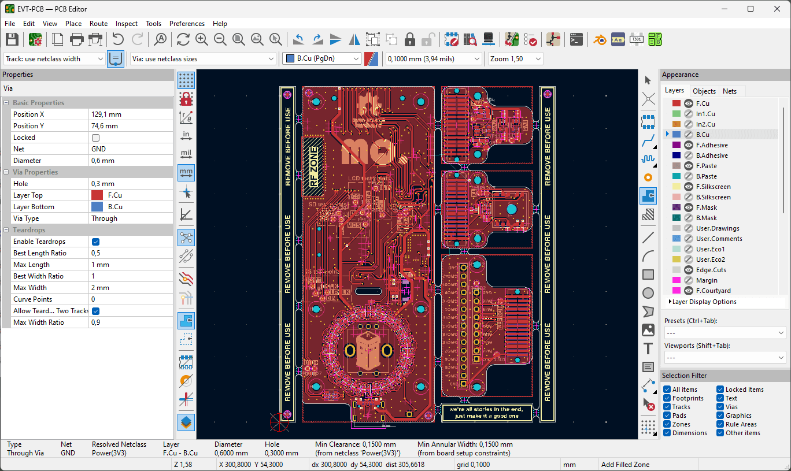

El proyecto ha consistido en el desarrollo del** MQ One**, un dispositivo electrónico programable modular, **desde la concepción y el diseño hasta su validación y montaje.**

El MQ One se ha concebido como una **plataforma de desarrollo** para el aprendizaje de la **programación de sistemas embebidos**. Por ello implementa los** componentes y sensores** **más utilizados **en el mundo de la electrónica listos para poder programarlos.

Incorpora desde **entradas y salidas**, con un encoder, un pulsador y 24 LEDs, hasta **componentes más avanzados**: pantalla, Unidad de Medición Inercial (IMU), microSD, micrófono y altavoz.

Además, mediante un conector que lleva en la parte trasera, se le pueden conectar **módulos adicionales**, permitiendo la conexión de nuevos sensores o características.

El MQ One se basa en el **Espressif ESP32-S3**, un **microcontrolador de 32-bit** y de** doble núcleo** a 24 MHz que además incorpora 32 MB de memoria flash y 8 MB de memoria PSRAM. Posee además conectividad **Wi-Fi de 2.4 GHz y Bluetooth 5 (LE).**

Todo el proyecto es **Open Source** y los archivos están disponibles en el siguiente repositorio de GitHub:

[https://github.com/mquerostudio/MQ-One](https://github.com/mquerostudio/MQ-One)

El MQ One lo he podido crear gracias a PCBWay, que me han fabricado y apoyado durante el desarrollo de las PCBs.

Registrándote en el siguiente enlace puedes conseguir 10$ de descuento en tu primer pedido!

[PCBWay](https://www.pcbway.es/g/HLdIwJ)

## Desarrollo del Proyecto

El proyecto se ha dividido en dos fases:

- Prueba de Concepto (POC), en la que se ha diseñado una PCB para probar las conexiones y uso de los distintos componentes que se han implementado en el MQ One. Para ello se han usado los módulos de prueba que vende  en su página web y que se pinchan a esta PCB.

- Pruebas de Validación de Ingeniería (EVT), en la que se ha diseñado, montado y verificado las tarjetas principales del MQ One. Destacar que se han panelizado la tarjeta principal, la tarjeta del módulo de la cámara, la tarjeta del módulo de montaña y la tarjeta del módulo de desarrollo para facilitar la fabricación y montaje.

## Esquemáticos y PCB de la fase POC

El proyecto de **KiCad** y sus archivos se encuentran en el repositorio de GitHub en la carpeta [1-Proof of Concept (POC)/2-ECAD.](https://github.com/mquerostudio/MQ-One/tree/master/1-Proof%20of%20Concept%20(POC)/2-ECAD)

Para ver los archivos sin necesidad de descargar KiCad se puede usar la siguiente página web de [kicanvas.org](https://kicanvas.org/) 

Todo lo relacionado con la selección de componentes, cálculos, diseños… se encuentra en la [memoria del TFG.](https://github.com/mquerostudio/MQ-One/blob/master/Trabajo%20Final%20de%20Grado.pdf)

## Esquemáticos y PCB de la fase EVT

De igual forma, el proyecto de **KiCad y sus archivos** se encuentran en el repositorio de GitHub en la carpeta [2-Engineering Validation Test (EVT)/2-ECAD.](https://github.com/mquerostudio/MQ-One/tree/master/2-Engineering%20Validation%20Test%20(EVT)/2-ECAD)

Para ver los archivos sin necesidad de descargar KiCad se puede usar la siguiente página web de [kicanvas.org](https://kicanvas.org/) 

Todo lo relacionado con la selección de componentes, cálculos, diseños… se encuentra en la [memoria del TFG.](https://github.com/mquerostudio/MQ-One/blob/master/Trabajo%20Final%20de%20Grado.pdf)

## Fallos de esquemático

Durante las pruebas de las placas se han detectado **2 fallos de esquemático y 2 de layout**, que se han podido resolver mediante retrabajos de soldadura con cable 0.2 mm. De cara a una nueva versión habría que hacer los **siguientes cambios**.

### Señales

Para que la tarjeta funcione correctamente habria que modificar algunas conexiones con el ESP32-S3.

### Huella del regulador de 3.3V

La** huella del regulador de 3.3V** está mal **dimensionada** y habría que hacerla correctamente. A la izquierda esta la huella actual y a la derecha la huella correcta.

### Señal de reset de la pantalla

Esta parte del esquemático se podría **eliminar** ya que se puede **implementar por código.**

### Huella del conector de la batería

A la izquierda se puede ver como un** bus de alimentación** de 3.3V pasa por encima de los conectores mecánicos del **conector** de la batería. Esto hace que **no se fabriquen correctamente.**

Aunque no ha generado problemas, a la larga puede generar problemas de **fiabilidad**, por lo que habría que solucionarlo.

## Firmware

Las** pruebas** para validar las funcionalidades y componentes de ambas placas se han realizado mediante** códigos de ejemplo**, utilizando el framework de **Arduino**.

Sin embargo, también se ha programado un **pequeño firmware basado en FreeRTOS y LVGL mediante el framework de ESP-IDF. **Por el momento, mediante este **Sistema Operativo (OS)**, se puede utilizar el módulo de montaña para coger datos del GPS y el sensor ambiental y el módulo de la cámara.

El objetivo es ir haciendo **artículos y tutoriales** para utilizar estos componentes, frameworks…

El **desarrollo** del MQ One ha sido un **proceso tedioso pero sobre todo gratificante**. Durante estos meses he podido aprender diseño electrónico, diseño mecánico, programación y, sobre todo, de cómo hacer una **integración** entre todas estas partes de la Ingeniería.

Cierro así una etapa muy especial en mi vida, terminando mi etapa universitaria y llevandome amistades y aprendizajes para el futuro.

**Este proyecto no ha terminado aqui, en unos meses se vienen noticias nuevas :)**

El proyecto ha consistido en el desarrollo del** MQ One**, un dispositivo electrónico programable modular, **desde la concepción y el diseño hasta su validación y montaje.**

El MQ One se ha concebido como una **plataforma de desarrollo** para el aprendizaje de la **programación de sistemas embebidos**. Por ello implementa los** componentes y sensores** **más utilizados **en el mundo de la electrónica listos para poder programarlos.

Incorpora desde **entradas y salidas**, con un encoder, un pulsador y 24 LEDs, hasta **componentes más avanzados**: pantalla, Unidad de Medición Inercial (IMU), microSD, micrófono y altavoz.

Además, mediante un conector que lleva en la parte trasera, se le pueden conectar **módulos adicionales**, permitiendo la conexión de nuevos sensores o características.

El MQ One se basa en el **Espressif ESP32-S3**, un **microcontrolador de 32-bit** y de** doble núcleo** a 24 MHz que además incorpora 32 MB de memoria flash y 8 MB de memoria PSRAM. Posee además conectividad **Wi-Fi de 2.4 GHz y Bluetooth 5 (LE).**

Todo el proyecto es **Open Source** y los archivos están disponibles en el siguiente repositorio de GitHub:

[https://github.com/mquerostudio/MQ-One](https://github.com/mquerostudio/MQ-One)

El MQ One lo he podido crear gracias a PCBWay, que me han fabricado y apoyado durante el desarrollo de las PCBs.

Registrándote en el siguiente enlace puedes conseguir 10$ de descuento en tu primer pedido!

[PCBWay](https://www.pcbway.es/g/HLdIwJ)

## Desarrollo del Proyecto

El proyecto se ha dividido en dos fases:

- Prueba de Concepto (POC), en la que se ha diseñado una PCB para probar las conexiones y uso de los distintos componentes que se han implementado en el MQ One. Para ello se han usado los módulos de prueba que vende  en su página web y que se pinchan a esta PCB.

- Pruebas de Validación de Ingeniería (EVT), en la que se ha diseñado, montado y verificado las tarjetas principales del MQ One. Destacar que se han panelizado la tarjeta principal, la tarjeta del módulo de la cámara, la tarjeta del módulo de montaña y la tarjeta del módulo de desarrollo para facilitar la fabricación y montaje.

## Esquemáticos y PCB de la fase POC

El proyecto de **KiCad** y sus archivos se encuentran en el repositorio de GitHub en la carpeta [1-Proof of Concept (POC)/2-ECAD.](https://github.com/mquerostudio/MQ-One/tree/master/1-Proof%20of%20Concept%20(POC)/2-ECAD)

Para ver los archivos sin necesidad de descargar KiCad se puede usar la siguiente página web de [kicanvas.org](https://kicanvas.org/) 

Todo lo relacionado con la selección de componentes, cálculos, diseños… se encuentra en la [memoria del TFG.](https://github.com/mquerostudio/MQ-One/blob/master/Trabajo%20Final%20de%20Grado.pdf)

## Esquemáticos y PCB de la fase EVT

De igual forma, el proyecto de **KiCad y sus archivos** se encuentran en el repositorio de GitHub en la carpeta [2-Engineering Validation Test (EVT)/2-ECAD.](https://github.com/mquerostudio/MQ-One/tree/master/2-Engineering%20Validation%20Test%20(EVT)/2-ECAD)

Para ver los archivos sin necesidad de descargar KiCad se puede usar la siguiente página web de [kicanvas.org](https://kicanvas.org/) 

Todo lo relacionado con la selección de componentes, cálculos, diseños… se encuentra en la [memoria del TFG.](https://github.com/mquerostudio/MQ-One/blob/master/Trabajo%20Final%20de%20Grado.pdf)

## Fallos de esquemático

Durante las pruebas de las placas se han detectado **2 fallos de esquemático y 2 de layout**, que se han podido resolver mediante retrabajos de soldadura con cable 0.2 mm. De cara a una nueva versión habría que hacer los **siguientes cambios**.

### Señales

Para que la tarjeta funcione correctamente habria que modificar algunas conexiones con el ESP32-S3.

### Huella del regulador de 3.3V

La** huella del regulador de 3.3V** está mal **dimensionada** y habría que hacerla correctamente. A la izquierda esta la huella actual y a la derecha la huella correcta.

### Señal de reset de la pantalla

Esta parte del esquemático se podría **eliminar** ya que se puede **implementar por código.**

### Huella del conector de la batería

A la izquierda se puede ver como un** bus de alimentación** de 3.3V pasa por encima de los conectores mecánicos del **conector** de la batería. Esto hace que **no se fabriquen correctamente.**

Aunque no ha generado problemas, a la larga puede generar problemas de **fiabilidad**, por lo que habría que solucionarlo.

## Firmware

Las** pruebas** para validar las funcionalidades y componentes de ambas placas se han realizado mediante** códigos de ejemplo**, utilizando el framework de **Arduino**.

Sin embargo, también se ha programado un **pequeño firmware basado en FreeRTOS y LVGL mediante el framework de ESP-IDF. **Por el momento, mediante este **Sistema Operativo (OS)**, se puede utilizar el módulo de montaña para coger datos del GPS y el sensor ambiental y el módulo de la cámara.

El objetivo es ir haciendo **artículos y tutoriales** para utilizar estos componentes, frameworks…

El **desarrollo** del MQ One ha sido un **proceso tedioso pero sobre todo gratificante**. Durante estos meses he podido aprender diseño electrónico, diseño mecánico, programación y, sobre todo, de cómo hacer una **integración** entre todas estas partes de la Ingeniería.

Cierro así una etapa muy especial en mi vida, terminando mi etapa universitaria y llevandome amistades y aprendizajes para el futuro.

**Este proyecto no ha terminado aqui, en unos meses se vienen noticias nuevas :)**

