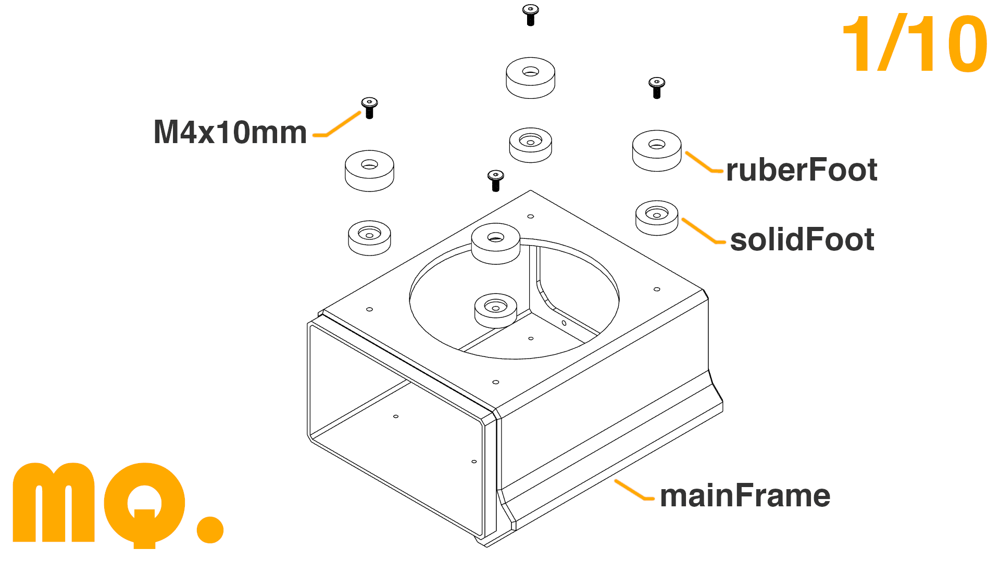
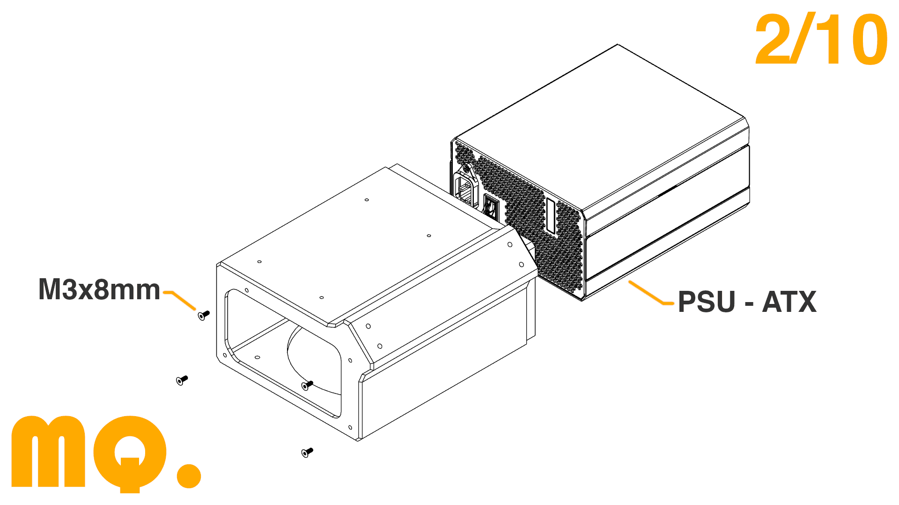
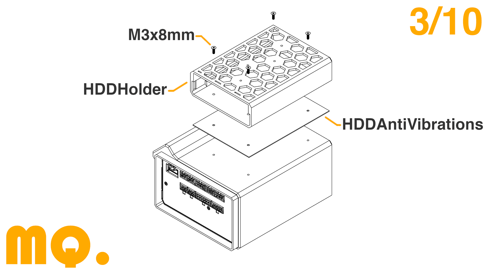
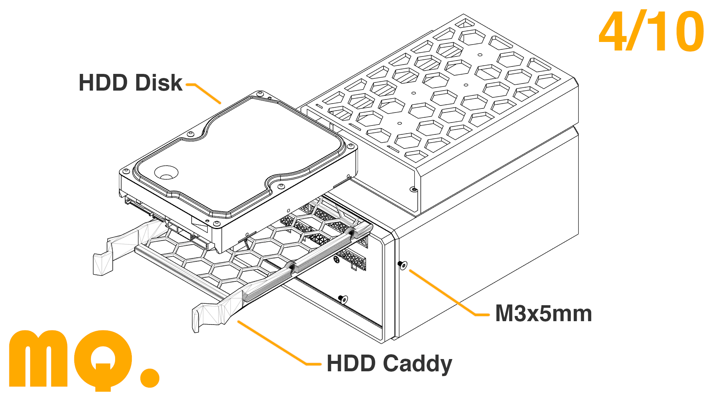
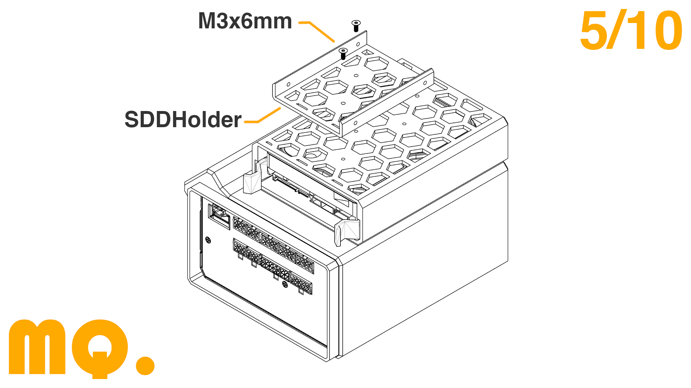
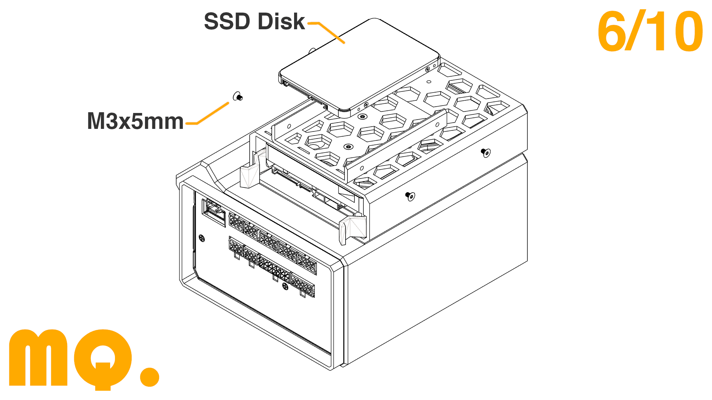
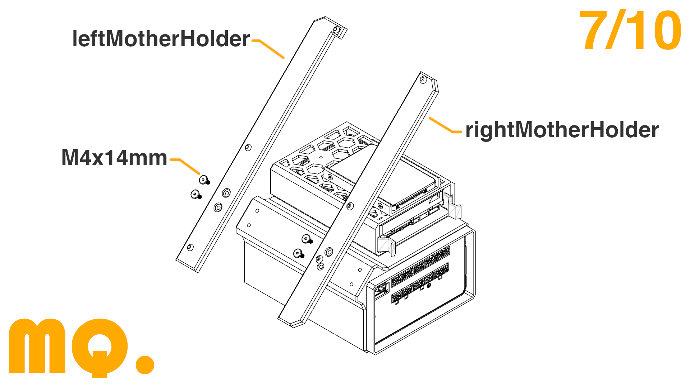
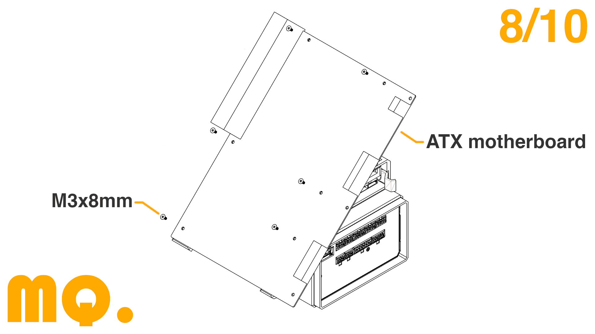
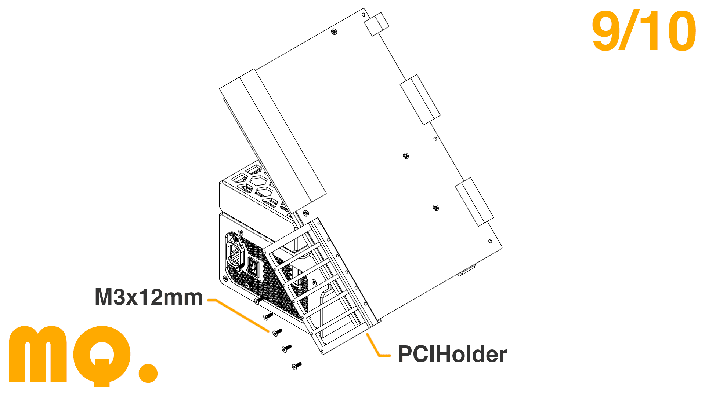
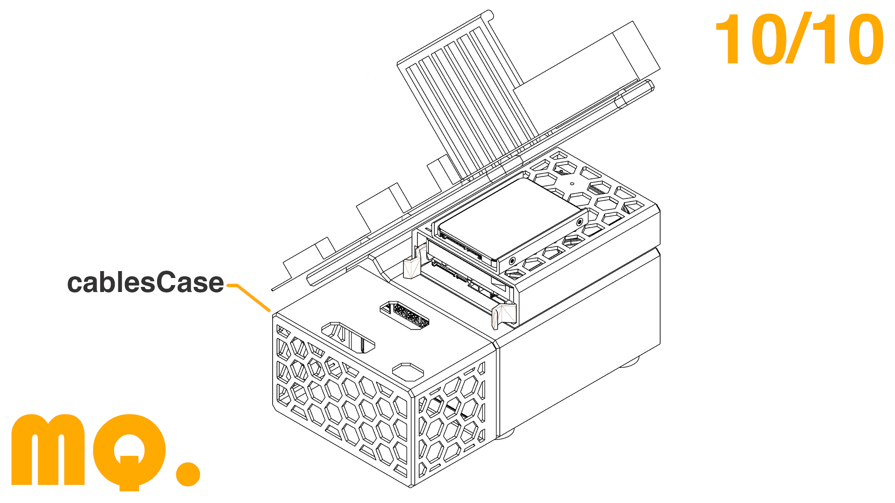

## Objetivo del proyecto

El objetivo del proyecto ha sido **diseñar una estructura abierta y modular para componentes ATX**. La estructura está enfocada a utilizar** placas base X99 **para Intel Xeon y es posible montar un **disco HDD** y un **disco SDD.**

## Archivos

Puedes encontrar todos los archivos para imprimir la estructura en este enlace:

- 

Te recomiendo que** imprimas las piezas usando ABS o PETG** para que no sufran deformaciones térmicas.

Los ficheros ***HDDAntiVibrations ***y ***4xrubberFoot ***están diseñados para imprimirlos en **TPU **o **TPE**. Si no tienes ninguno de estos materiales, puedes imprimir el ***HDDAntiVibrations ***en **ABS **y el ***4xrubberFoot ***no es necesario imprimirlo.

Para el **HDD Caddy**, puedes imprimir el [Squirtles HDD Caddy](https://www.printables.com/model/40826-35-generic-hdd-caddy)**.**

## Información Importante

Las **dos partes impresas **donde se atornilla la placa base están diseñadas para la **Machinist MR9A PRO MAX.**

**Si tienes otra placa base **y no puedes atornillarla correctamente porque la distancia entre los agujeros es diferente, **mándame un mensaje por Instagram con las distancias que necesitas** y subiré las piezas actualizadas 🙌.

## Componentes

- Placa Base Machinist MR9A PRO MAX: 
- Procesador Intel Xeon E5 2697A:  
- Bloque de refrigeración Teucer:  
- Tarjeta WiFi/Bluetooth:  
- Filtro de polvo:  
- Tornillos: 

## Video Completo de YouTube

Siguiendo este enlace puedes ver el **vídeo dedicado en YouTube:**

[https://www.youtube.com/watch?v=lF41ytBCWMM](https://www.youtube.com/watch?v=lF41ytBCWMM)

I have been able to make this project possible thanks to the **sponsor of PCBWay.**

He podido realizar este** proyecto gracias a PCBWay.**

**PCBWay **ofrece **servicios de impresión 3D, CNC y mucho más**, para que puedas fabricar** cualquier diseño que tengas** sin necesidad de tener **ninguna máquina en tu casa.**

Están **especializados en la fabricación de PCBs **ofreciendo placas desde dos capas a un **precio y calidad inmejorables.**

Registrándote en el siguiente enlace podrás **conseguir 10$ de descuento** en tu primer pedido:

[https://www.pcbway.es/g/HLdIwJ](https://www.pcbway.es/g/HLdIwJ)

## Montaje

- Atornilla las cuatro patas con tornillos M4x10mm. Si también has impreso las patas de goma, insertalas después de atornillar.

- Inserta la fuente de alimentación dentro de la estructura principal y atorníllala con cuatro tornillos M3x8mm.

- Primero, coloca el espaciador de TPU para evitar vibraciones y luego coloca el soporte del HDD encima. Atornilla ambos con cuatro M3x8mm.

- Atornilla el Caddy y el HDD con cuatro tornillos M3x5mm y coloca el Caddy dentro del Soporte HDD.

- Atornilla el soporte para SDD sobre el soporte para HDD con dos tornillos M3X5mm.

- Atornilla el Disco SDD con tornillos M3x5mm.

- Atornilla ambos soportes de placa base con cuatro tornillos M4x14mm en la estructura principal.

- Coloca y atornilla la placa base con tornillos M3x8mm.

- Si vas a utilizar alguna tarjeta PCI, atornilla el Soporte PCI con siete tornillos M3x12mm.

- Cablea todo e inserta la parte de la caja que tapa los cables.

## Redes Sociales

- YouTube: 
- Intagram: 
- TikTok: 

